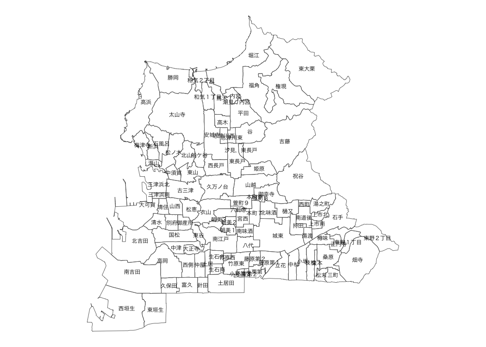
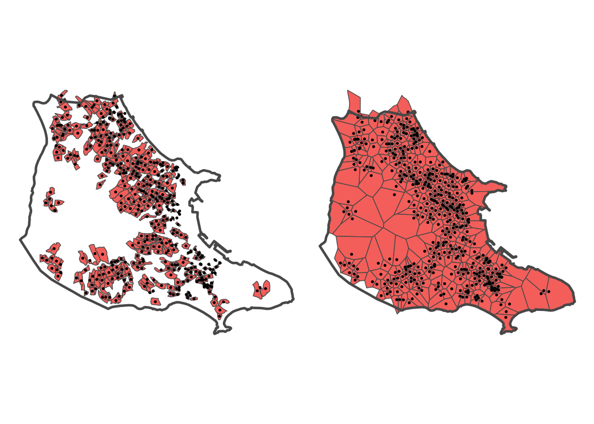
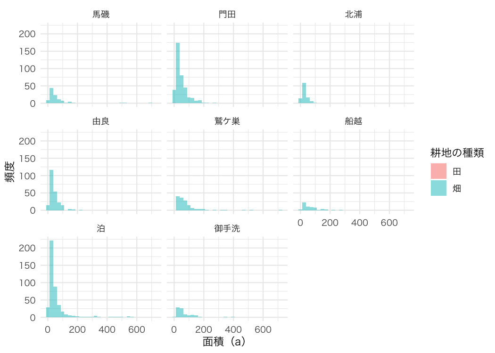

<!-- README.md is generated from README.Rmd. Please edit that file -->

# fude

<!-- badges: start -->

[](https://github.com/takeshinishimura/fude/actions/workflows/check-standard.yaml)
[](https://CRAN.R-project.org/package=fude)
<!-- badges: end -->

The fude package provides utilities to facilitate the handling of the
Fude Polygon data downloadable from the Ministry of Agriculture,
Forestry and Fisheries (MAFF) website. The word “fude” is a Japanese
counter suffix used to denote land parcels.

## Obtaining Data

Download the Fude Polygon data from the following MAFF release site
(available only in Japanese):

- <https://open.fude.maff.go.jp>

## Installation

You can install the released version of fude from CRAN with:

``` r
install.packages("fude")
```

Or the development version from GitHub with:

``` r
# install.packages("devtools")
devtools::install_github("takeshinishimura/fude")
```

## Usage

### Reading Fude Polygon Data

You can let R read the downloaded ZIP file directly without unzipping
it.

``` r
library(fude)
d <- read_fude("~/2022_38.zip")
```

### Renaming Columns

You can convert local government codes into Japanese municipality names
for easier management.

``` r
d2 <- rename_fude(d)
names(d2)
#>  [1] "2022_松山市"     "2022_今治市"     "2022_宇和島市"   "2022_八幡浜市"  
#>  [5] "2022_新居浜市"   "2022_西条市"     "2022_大洲市"     "2022_伊予市"    
#>  [9] "2022_四国中央市" "2022_西予市"     "2022_東温市"     "2022_上島町"    
#> [13] "2022_久万高原町" "2022_松前町"     "2022_砥部町"     "2022_内子町"    
#> [17] "2022_伊方町"     "2022_松野町"     "2022_鬼北町"     "2022_愛南町"
```

You can also rename the columns to Romaji instead of Japanese.

``` r
d2 <- d |> rename_fude(suffix = TRUE, romaji = "title")
names(d2)
#>  [1] "2022_Matsuyama-shi"   "2022_Imabari-shi"     "2022_Uwajima-shi"    
#>  [4] "2022_Yawatahama-shi"  "2022_Niihama-shi"     "2022_Saijo-shi"      
#>  [7] "2022_Ozu-shi"         "2022_Iyo-shi"         "2022_Shikokuchuo-shi"
#> [10] "2022_Seiyo-shi"       "2022_Toon-shi"        "2022_Kamijima-cho"   
#> [13] "2022_Kumakogen-cho"   "2022_Matsumae-cho"    "2022_Tobe-cho"       
#> [16] "2022_Uchiko-cho"      "2022_Ikata-cho"       "2022_Matsuno-cho"    
#> [19] "2022_Kihoku-cho"      "2022_Ainan-cho"
```

### Getting Agricultural Community Boundary Data

You can download the agricultural community boundary data, which
corresponds to the Fude Polygon data, from the MAFF website at
<https://www.maff.go.jp/j/tokei/census/shuraku_data/2020/ma/> (available
only in Japanese).

``` r
b <- get_boundary(d)
```

You can easily create a map that combines Fude Polygons with
agricultural community boundaries.

``` r
db <- combine_fude(d, b, city = "松山市", community = "由良|北浦|鷲ケ巣|門田|馬磯|泊|御手洗|船越")

library(ggplot2)

ggplot() +
  geom_sf(data = db$fude_split, aes(fill = RCOM_NAME)) +
  guides(fill = guide_legend(reverse = TRUE, title = "興居島の集落別耕地")) +
  theme_void() +
  theme(text = element_text(family = "Hiragino Sans"))
```


**出典**：農林水産省「筆ポリゴンデータ（2022年度公開）」および「農業集落境界データ（2022年度）」を加工して作成。

Polygon data near community borders may be divided. To avoid this, use
`db$fude`.

``` r
library(ggforce)

ggplot() +
  geom_sf(data = db$community, fill = NA) +
  geom_sf(data = db$fude, aes(fill = RCOM_ROMAJI)) +
  geom_mark_hull(data = db$fude, 
                 aes(x = point_lng, y = point_lat,
                     fill = RCOM_ROMAJI,
                     label = RCOM_ROMAJI),
                 colour = NA,
                 expand = unit(1, "mm"),
                 radius = unit(1, "mm"),
                 label.fontsize = 9,
                 label.family = "Helvetica",
                 label.fill = NA,
                 label.colour = "black",
                 label.buffer = unit(1, "mm"),
                 con.colour = "gray70") +
  theme_no_axes() +
  theme(legend.position = "none")
```


**Source**: Created by processing the Ministry of Agriculture, Forestry
and Fisheries, ‘Fude Polygon Data (released in FY2022)’ and
‘Agricultural Community Boundary Data (FY2022)’.

Polygons on community boundaries are not divided but are assigned to one
of the communities. If you need to adjust this automatic assignment, you
will need to write custom code. The rows that require attention can be
identified with the following command.

``` r
library(dplyr)
library(sf)

# head(sf::st_drop_geometry(db$fude[db$fude$polygon_uuid %in% db$fude_split$polygon_uuid[duplicated(db$fude_split$polygon_uuid)], c("polygon_uuid", "PREF_NAME", "CITY_NAME", "KCITY_NAME", "RCOM_NAME", "RCOM_KANA", "RCOM_ROMAJI")]))
db$fude |>
  filter(polygon_uuid %in% (db$fude_split |> filter(duplicated(polygon_uuid)) |> pull(polygon_uuid))) |>
  sf::st_drop_geometry() |>
  select(polygon_uuid, KCITY_NAME, RCOM_NAME, RCOM_KANA, RCOM_ROMAJI) |>
  head()
#> # A tibble: 6 × 5
#>   polygon_uuid                        KCITY_NAME RCOM_NAME RCOM_KANA RCOM_ROMAJI
#>   <chr>                               <fct>      <fct>     <fct>     <fct>      
#> 1 8085bc47-9af5-440f-89e9-f188d3b957… 興居島村   泊        とまり    Tomari     
#> 2 26920da0-b63e-4994-a9eb-175e2982fe… 興居島村   門田      かどた    Kadota     
#> 3 ac2e7293-6c2f-4feb-a95f-4729dc8d0a… 興居島村   由良      ゆら      Yura       
#> 4 ea130038-7035-4cf3-b71c-091783090d… 興居島村   船越      ふなこし  Funakoshi  
#> 5 4aba8229-1b14-4eab-8a91-e10d9e8411… 興居島村   船越      ふなこし  Funakoshi  
#> 6 156a3459-25cb-494c-824f-9ba6b0fb6f… 興居島村   由良      ゆら      Yura
```

### Visualizing Fude Polygon Data

You can confirm Fude Polygon data in detail.

``` r
library(shiny)

s <- shiny_fude(db, community = TRUE)
# shiny::shinyApp(ui = s$ui, server = s$server)
```

This feature was heavily inspired by the following website:
<https://brendenmsmith.com/blog/shiny_map_filter/>

### Using `gghighlight` Package

The `gghighlight` package enables practical and effective visualization.

``` r
library(forcats)
library(gghighlight)

db$community <- db$community %>%
  mutate(across(c(RCOM_NAME, RCOM_KANA, RCOM_ROMAJI), forcats::fct_rev))
db$fude <- db$fude %>%
  mutate(across(c(RCOM_NAME, RCOM_KANA, RCOM_ROMAJI), forcats::fct_rev))

ggplot() +
  geom_sf(data = db$community, aes(fill = RCOM_NAME), alpha = 0) +
  geom_sf(data = db$fude, aes(fill = RCOM_NAME), linewidth = 0) +
  gghighlight() +
  facet_wrap(vars(RCOM_NAME)) +
  theme_void() +
  theme(legend.position = "none",
        text = element_text(family = "Hiragino Sans"))
```


**出典**：農林水産省「筆ポリゴンデータ（2022年度公開）」および「農業集落境界データ（2022年度）」を加工して作成。

``` r
ggplot(data = db$fude, aes(x = as.numeric(a), fill = land_type_jp)) +
  geom_histogram(position = "identity", alpha = .5) +
  labs(x = "面積（a）",
       y = "頻度") +
  facet_wrap(vars(RCOM_NAME)) +
  labs(fill = "耕地の種類") +
  theme_minimal() +
  theme(text = element_text(family = "Hiragino Sans"))
```


### Using `mapview` package

If you want to use `mapview()`, do the following.

``` r
db1 <- combine_fude(d, b, city = "伊方町")
db2 <- combine_fude(d, b, city = "八幡浜市")
db3 <- combine_fude(d, b, city = "西予市", old_village = "三瓶|二木生|三島|双岩")
db <- bind_fude(db1, db2, db3)

library(mapview)

mapview::mapview(db$fude, zcol = "RCOM_NAME", layer.name = "農業集落名")
```

### Additional Information

There are 7 types of objects obtained by `combine_fude()`, as follows:

``` r
names(db)
#> [1] "fude"            "fude_split"      "community"       "community_union"
#> [5] "ov"              "lg"              "pref"
```

The possible values for `community` in `combine_fude()` can be listed as
follows.

``` r
library(data.tree)

b[[1]] |>
  filter(grepl("松山", KCITY_NAME)) |>
  mutate(pathString = paste(PREF_NAME, CITY_NAME, KCITY_NAME, RCOM_NAME, sep = "/")) |>
  data.tree::as.Node() |>
  print(limit = 10)
#>                              levelName
#> 1  愛媛県                             
#> 2   °--松山市                        
#> 3       °--松山市                    
#> 4           ¦--土居田                
#> 5           ¦--針田                  
#> 6           ¦--小栗第１              
#> 7           ¦--小栗第２              
#> 8           ¦--小栗第３              
#> 9           ¦--藤原第１              
#> 10          °--... 102 nodes w/ 0 sub
ggplot(data = b[[1]] |> filter(grepl("松山", KCITY_NAME))) + 
  geom_sf(fill = NA) +
  geom_sf_text(aes(label = RCOM_NAME), size = 2, family = "Hiragino Sans") +
  theme_void()
```



``` r
db$fude_points <- db$fude %>%
  sf::st_drop_geometry() %>%
  dplyr::mutate(
    geometry = purrr::map(centroid, ~ sf::st_point(c(.x[1], .x[2])))
  ) %>%
  dplyr::mutate(
    geometry = sf::st_sfc(geometry, crs = 4326)
  ) %>%
  sf::st_as_sf(crs = 4326)

fude_points_projected <- sf::st_transform(db$fude_points, crs = 32633)
community_union_projected <- sf::st_transform(db$community_union, crs = 32633)

voronoi <- fude_points_projected %>%
  sf::st_geometry() %>%
  sf::st_union() %>%
  sf::st_voronoi() %>%
  sf::st_collection_extract(type = "POLYGON") %>%
  sf::st_sf(crs = 32633) %>%
  sf::st_intersection(y = sf::st_geometry(community_union_projected)) %>%
  sf::st_join(y = fude_points_projected) %>%
  dplyr::select(-geometry.y) %>%
  dplyr::rename(geometry = geometry.x) %>%
  sf::st_cast("POLYGON") %>%
  sf::st_transform(crs = 4326)

library(patchwork)

map1 <- ggplot() +
  geom_sf(data = db$fude |> filter(RCOM_NAME == "泊"), aes(fill = RCOM_NAME), linewidth = .3) +
  geom_sf(data = db$fude_points |> filter(RCOM_NAME == "泊"), size = .5) +
  geom_sf(data = db$community |> filter(RCOM_NAME == "泊"), aes(fill = RCOM_NAME), alpha = 0, linewidth = 1) +
  theme_void() +
  theme(legend.position = "none")

map2 <- ggplot() +
  geom_sf(data = voronoi |> filter(RCOM_NAME == "泊"), aes(fill = RCOM_NAME), linewidth = .3) +
  geom_sf(data = db$fude_points |> filter(RCOM_NAME == "泊"), size = .5) +
  geom_sf(data = db$community |> filter(RCOM_NAME == "泊"), aes(fill = RCOM_NAME), alpha = 0, linewidth = 1) +
  theme_void() +
  theme(legend.position = "none")

map1 + map2
```



**出典**：農林水産省「筆ポリゴンデータ（2022年度公開）」および「農業集落境界データ（2022年度）」を加工して作成。

``` r
voronoi$area_voronoi <- sf::st_area(voronoi)
voronoi$a_voronoi <- units::set_units(voronoi$area_voronoi, "a")

ggplot(data = voronoi, aes(x = as.numeric(a_voronoi), fill = land_type_jp)) +
  geom_histogram(position = "identity", alpha = .5) +
  labs(x = "面積（a）",
       y = "頻度") +
  facet_wrap(vars(RCOM_NAME)) +
  labs(fill = "耕地の種類") +
  theme_minimal() +
  theme(text = element_text(family = "Hiragino Sans"))
```


