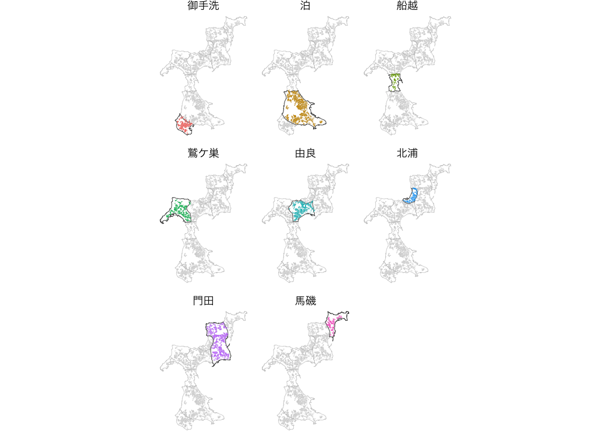
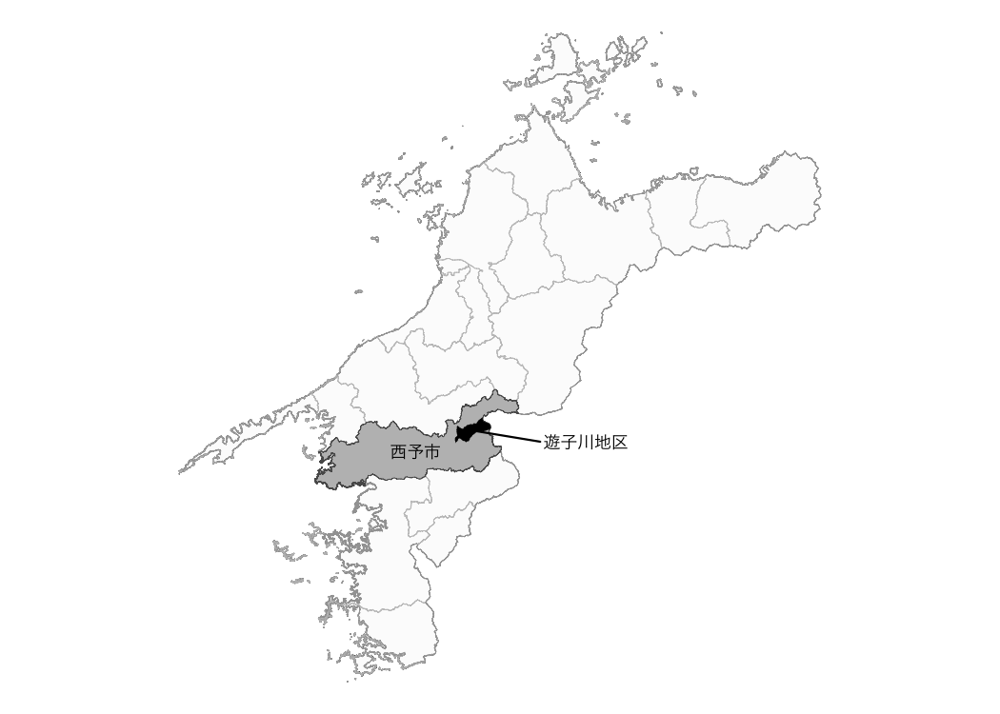

<!-- README.md is generated from README.Rmd. Please edit that file -->

# fude

<!-- badges: start -->

[](https://github.com/takeshinishimura/fude/actions/workflows/check-standard.yaml)
[](https://CRAN.R-project.org/package=fude)
<!-- badges: end -->

The fude package provides utilities to facilitate handling of Fude
Polygon data downloadable from the Ministry of Agriculture, Forestry and
Fisheries (MAFF) website. The word fude is a Japanese counter suffix
used when referring to land parcels.

## Obtaining Data

Download the Fude Polygon data from the following release site of MAFF
(only Japanese is available).

- <https://open.fude.maff.go.jp>

## Installation

You can install the released version of fude from CRAN with:

``` r
install.packages("fude")
```

Or the development version from GitHub with:

``` r
# install.packages("devtools")
devtools::install_github("takeshinishimura/fude")
```

## Usage

You can let R read the downloaded ZIP file without unzipping it.

``` r
library(fude)
d <- read_fude("~/2022_38.zip")
```

Those who wish to use a mouse or trackpad for file selection, which is
especially common among R beginners, can do the following.

``` r
d <- read_fude(file.choose())
```

You can rename the local government codes to the Japanese municipality
names for easier handling.

``` r
d2 <- rename_fude(d)
#> 2022_382019 -> 2022_松山市
#> 2022_382027 -> 2022_今治市
#> 2022_382035 -> 2022_宇和島市
#> 2022_382043 -> 2022_八幡浜市
#> 2022_382051 -> 2022_新居浜市
#> 2022_382060 -> 2022_西条市
#> 2022_382078 -> 2022_大洲市
#> 2022_382108 -> 2022_伊予市
#> 2022_382132 -> 2022_四国中央市
#> 2022_382141 -> 2022_西予市
#> 2022_382159 -> 2022_東温市
#> 2022_383562 -> 2022_上島町
#> 2022_383864 -> 2022_久万高原町
#> 2022_384011 -> 2022_松前町
#> 2022_384020 -> 2022_砥部町
#> 2022_384224 -> 2022_内子町
#> 2022_384429 -> 2022_伊方町
#> 2022_384844 -> 2022_松野町
#> 2022_384887 -> 2022_鬼北町
#> 2022_385069 -> 2022_愛南町
```

It can also be renamed to romaji instead of Japanese.

``` r
d3 <- d |> rename_fude(suffix = TRUE, romaji = "title", quiet = TRUE)
names(d3)
#>  [1] "2022_Matsuyama-shi"   "2022_Imabari-shi"     "2022_Uwajima-shi"    
#>  [4] "2022_Yawatahama-shi"  "2022_Niihama-shi"     "2022_Saijo-shi"      
#>  [7] "2022_Ozu-shi"         "2022_Iyo-shi"         "2022_Shikokuchuo-shi"
#> [10] "2022_Seiyo-shi"       "2022_Toon-shi"        "2022_Kamijima-cho"   
#> [13] "2022_Kumakogen-cho"   "2022_Matsumae-cho"    "2022_Tobe-cho"       
#> [16] "2022_Uchiko-cho"      "2022_Ikata-cho"       "2022_Matsuno-cho"    
#> [19] "2022_Kihoku-cho"      "2022_Ainan-cho"
```

You can download the agricultural community boundary data corresponding
to the Fude Polygon data from the MAFF website
<https://www.maff.go.jp/j/tokei/census/shuraku_data/2020/ma/> (only
Japanese is available).

``` r
b <- get_boundary(d)
```

You can easily draw a map combining Fude Polygons and agricultural
community boundaries.

``` r
library(ggplot2)

db <- combine_fude(d, b, city = "松山市", community = "由良|北浦|鷲ケ巣|門田|馬磯|泊|御手洗|船越")

ggplot() +
  geom_sf(data = db$fude_split, aes(fill = RCOM_NAME)) +
  theme_void()
```


**出典**：農林水産省「筆ポリゴンデータ（2022年度公開）」および「農業集落境界データ（2020年度）」を加工して作成。

Polygon data near the boundaries between communities may be split. To
avoid this, do the following.

``` r
ggplot() +
  geom_sf(data = db$community, fill = NA) +
  geom_sf(data = db$fude, aes(fill = RCOM_NAME)) +
  guides(fill = guide_legend(reverse = TRUE, title = "興居島の集落別耕地")) +
  theme_void() +
  theme(text = element_text(family = "Hiragino Sans"))
```


**出典**：農林水産省「筆ポリゴンデータ（2022年度公開）」および「農業集落境界データ（2020年度）」を加工して作成。

Polygons located on community boundaries are not split, but are assigned
to one of the communities. If this automatic assignment needs to be
modified, ad hoc coding is required.

The gghighlight package allows for a wider range of expression.

``` r
library(gghighlight)

ggplot() +
  geom_sf(data = db$community, aes(fill = RCOM_NAME), alpha = 0) +
  geom_sf(data = db$fude, aes(fill = RCOM_NAME), linewidth = 0) +
  gghighlight() +
  facet_wrap(vars(RCOM_NAME)) +
  theme_void() +
  theme(legend.position = "none",
        text = element_text(family = "Hiragino Sans"))
```



**Source**: Created by processing the Ministry of Agriculture, Forestry
and Fisheries, *Fude Polygon Data (released in FY2022)* and
*Agricultural Community Boundary Data (FY2020)*.

There are 8 types of objects obtained by `combine_fude()` as follows.

``` r
names(db)
#> [1] "fude"            "fude_split"      "community"       "community_union"
#> [5] "ov"              "lg"              "pref"            "source"
```

If you want to be particular about the details of the map, for example,
execute the following code.

``` r
library(ggrepel)
library(cowplot)

db <- combine_fude(d, b, city = "松山市", old_village = "興居島", community = "^(?!釣島).*")

minimap <- ggplot() +
  geom_sf(data = db$lg, aes(fill = fill)) +
  geom_sf_text(data = db$lg, aes(label = city_kanji), family = "Hiragino Sans") +
  gghighlight(fill == 1) +
  geom_sf(data = db$community_union, fill = "black", linewidth = 0) +
  theme_void() +
  theme(panel.background = element_rect(fill = "aliceblue")) +
  scale_fill_manual(values = c("white", "gray"))

mainmap <- ggplot() +
  geom_sf(data = db$community, fill = "white") +
  geom_sf(data = db$fude, aes(fill = RCOM_NAME)) +
  geom_point(data = db$community, aes(x = x, y = y), colour = "gray") +
  geom_text_repel(data = db$community,
                  aes(x = x, y = y, label = RCOM_NAME),
                  nudge_x = c(-.01, .01, -.01, -.012, .005, -.01, .01, .01),
                  nudge_y = c(.005, .005, 0, .01, -.005, .01, 0, -.005),
                  min.segment.length = .01,
                  segment.color = "gray",
                  size = 3,
                  family = "Hiragino Sans") +
  theme_void() +
  theme(legend.position = "none")

ggdraw(mainmap) +
  draw_plot(
    {minimap +
       geom_rect(aes(xmin = 132.47, xmax = 133.0,
                     ymin = 33.72, ymax = 34.05),
                 fill = NA,
                 colour = "black",
                 size = .5) +
       coord_sf(xlim = c(132.47, 133.0),
                ylim = c(33.72, 34.05),
                expand = FALSE) +
       theme(legend.position = "none")
    },
    x = .7, 
    y = 0,
    width = .3, 
    height = .3)
```

This package may be beneficial, especially for R beginners, when simply
wanting to draw agricultural community boundaries.

``` r
library(dplyr)
library(ggrepel)

db <- combine_fude(d, b, city = "西予市", old_village = "遊子川")

ggplot() +
  geom_sf(data = db$pref, fill = NA) +
  geom_sf(data = db$lg, fill = "gray") +
  gghighlight(fill == 1,
    unhighlighted_params = list(
      alpha = .05
    )) +
  geom_sf(data = db$ov |> filter(fill == 1), colour = NA, fill = "black") +
  geom_sf_text(data = db$lg |> filter(fill == 1),
               aes(label = city_kanji),
               size = 3,
               nudge_x = -.025, nudge_y = -.025,
               family = "Hiragino Sans") +
  geom_point(data = db$community_union, aes(x = x, y = y), colour = "black") +
  geom_text_repel(data = db$community_union,
                  aes(x = x, y = y),
                  label = "遊子川地区",
                  nudge_x = .3, nudge_y = -.025,
                  segment.color = "black",
                  size = 3,
                  family = "Hiragino Sans") +
  theme_void()
```



**出典**：農林水産省「筆ポリゴンデータ（2022年度公開）」および「農業集落境界データ（2020年度）」を加工して作成。

If you want to use `mapview()`, do the following.

``` r
library(mapview)

db1 <- combine_fude(d, b, city = "伊方町")
db2 <- combine_fude(d, b, city = "八幡浜市")
db3 <- combine_fude(d, b, city = "西予市", old_village = "三瓶|二木生|三島|双岩")
db <- bind_fude(db1, db2, db3)

mapview::mapview(db$fude, zcol = "RCOM_NAME", layer.name = "農業集落名")
```
