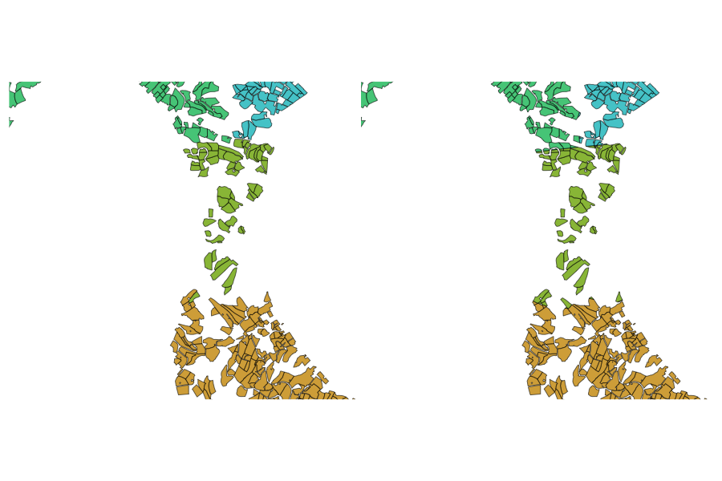

<!-- README.md is generated from README.Rmd. Please edit that file -->

# fude

<!-- badges: start -->

[](https://github.com/takeshinishimura/fude/actions/workflows/check-standard.yaml)
[](https://CRAN.R-project.org/package=fude)
<!-- badges: end -->

The fude package provides utilities to facilitate the handling of the
Fude Polygon data downloadable from the Ministry of Agriculture,
Forestry and Fisheries (MAFF) website. The word “fude” is a Japanese
counter suffix used to denote land parcels.

## Obtain data

Fude Polygon data can now be downloaded from two different MAFF websites
(both available only in Japanese):

1.  **GeoJSON format**:  
    <https://open.fude.maff.go.jp>

2.  **FlatGeobuf format**:  
    <https://www.maff.go.jp/j/tokei/census/shuraku_data/2020/mb/>

## Install the package

You can install the released version of fude from CRAN with:

``` r
install.packages("fude")
```

Or the development version from GitHub with:

``` r
# install.packages("devtools")
devtools::install_github("takeshinishimura/fude")
```

## Usage

### Read Fude Polygon data

There are two ways to load Fude Polygon data, depending on how the data
was obtained:

1.  **From a locally saved ZIP file**:  
    This method works for both GeoJSON (from Obtaining Data \#1) and
    FlatGeobuf (from Obtaining Data \#2) formats. You can load a ZIP
    file saved on your computer without unzipping it.

``` r
library(fude)
d <- read_fude("~/2022_38.zip")
```

2.  **By specifying a prefecture name or code**:  
    This method is available only for FlatGeobuf data (from Obtaining
    Data \#2). Provide the name of a prefecture (e.g., “愛媛”) or its
    corresponding prefecture code (e.g., “38”), and the required
    FlatGeobuf format ZIP file will be automatically downloaded and
    loaded.

``` r
d2 <- read_fude(pref = "愛媛")
```

### Inspect the structure of Fude Polygon data

``` r
ls_fude(d)
#>           name issue_year local_government_cd     n pref_name  city_name
#> 1  2022_382019       2022              382019 72045    愛媛県     松山市
#> 2  2022_382027       2022              382027 43396    愛媛県     今治市
#> 3  2022_382035       2022              382035 61683    愛媛県   宇和島市
#> 4  2022_382043       2022              382043 37753    愛媛県   八幡浜市
#> 5  2022_382051       2022              382051 15734    愛媛県   新居浜市
#> 6  2022_382060       2022              382060 63244    愛媛県     西条市
#> 7  2022_382078       2022              382078 37570    愛媛県     大洲市
#> 8  2022_382108       2022              382108 33302    愛媛県     伊予市
#> 9  2022_382132       2022              382132 34781    愛媛県 四国中央市
#> 10 2022_382141       2022              382141 73676    愛媛県     西予市
#> 11 2022_382159       2022              382159 24235    愛媛県     東温市
#> 12 2022_383562       2022              383562  2195    愛媛県     上島町
#> 13 2022_383864       2022              383864 22823    愛媛県 久万高原町
#> 14 2022_384011       2022              384011  8634    愛媛県     松前町
#> 15 2022_384020       2022              384020  7042    愛媛県     砥部町
#> 16 2022_384224       2022              384224 27131    愛媛県     内子町
#> 17 2022_384429       2022              384429 23429    愛媛県     伊方町
#> 18 2022_384844       2022              384844  9089    愛媛県     松野町
#> 19 2022_384887       2022              384887 16550    愛媛県     鬼北町
#> 20 2022_385069       2022              385069 22931    愛媛県     愛南町
#>        city_romaji
#> 1    Matsuyama-shi
#> 2      Imabari-shi
#> 3      Uwajima-shi
#> 4   Yawatahama-shi
#> 5      Niihama-shi
#> 6        Saijo-shi
#> 7          Ozu-shi
#> 8          Iyo-shi
#> 9  Shikokuchuo-shi
#> 10       Seiyo-shi
#> 11        Toon-shi
#> 12    Kamijima-cho
#> 13   Kumakogen-cho
#> 14    Matsumae-cho
#> 15        Tobe-cho
#> 16      Uchiko-cho
#> 17       Ikata-cho
#> 18     Matsuno-cho
#> 19      Kihoku-cho
#> 20       Ainan-cho
```

### Rename the local government code

**Note:** This feature is available only for data obtained from GeoJSON
(Obtaining Data \#1).

Convert local government codes into Japanese municipality names for
easier management.

``` r
dren <- rename_fude(d)
names(dren)
#>  [1] "2022_松山市"     "2022_今治市"     "2022_宇和島市"   "2022_八幡浜市"  
#>  [5] "2022_新居浜市"   "2022_西条市"     "2022_大洲市"     "2022_伊予市"    
#>  [9] "2022_四国中央市" "2022_西予市"     "2022_東温市"     "2022_上島町"    
#> [13] "2022_久万高原町" "2022_松前町"     "2022_砥部町"     "2022_内子町"    
#> [17] "2022_伊方町"     "2022_松野町"     "2022_鬼北町"     "2022_愛南町"
```

You can also rename the columns to Romaji instead of Japanese.

``` r
dren <- d |> rename_fude(suffix = TRUE, romaji = "title")
names(dren)
#>  [1] "2022_Matsuyama-shi"   "2022_Imabari-shi"     "2022_Uwajima-shi"    
#>  [4] "2022_Yawatahama-shi"  "2022_Niihama-shi"     "2022_Saijo-shi"      
#>  [7] "2022_Ozu-shi"         "2022_Iyo-shi"         "2022_Shikokuchuo-shi"
#> [10] "2022_Seiyo-shi"       "2022_Toon-shi"        "2022_Kamijima-cho"   
#> [13] "2022_Kumakogen-cho"   "2022_Matsumae-cho"    "2022_Tobe-cho"       
#> [16] "2022_Uchiko-cho"      "2022_Ikata-cho"       "2022_Matsuno-cho"    
#> [19] "2022_Kihoku-cho"      "2022_Ainan-cho"
```

### Get agricultural community boundary data

Download the agricultural community boundary data, which corresponds to
the Fude Polygon data, from the MAFF website:
<https://www.maff.go.jp/j/tokei/census/shuraku_data/2020/ma/> (available
only in Japanese).

``` r
b <- get_boundary(d)
```

### Combine Fude Polygons with agricultural community boundaries

You can easily combine Fude Polygons with agricultural community
boundaries to create enriched spatial analyses or maps.

#### GeoJSON data characteristics (obtain data \#1)

``` r
db <- combine_fude(d, b, city = "松山市", rcom = "由良|北浦|鷲ケ巣|門田|馬磯|泊|御手洗|船越")

library(ggplot2)

ggplot() +
  geom_sf(data = db$fude, aes(fill = rcom_name), alpha = .8) +
  guides(fill = guide_legend(reverse = TRUE, title = "興居島の集落別耕地")) +
  theme_void() +
  theme(legend.position = "bottom") +
  theme(text = element_text(family = "Hiragino Sans"))
```


**出典**：農林水産省「筆ポリゴンデータ（2022年度公開）」および「農業集落境界データ（2020年度）」を加工して作成。

##### Data assignment

- `db$fude`: Automatically assigns polygons on the boundaries to a
  community.
- `db$fude_split`: Provides cleaner boundaries, but polygon data near
  community borders may be divided.

``` r
library(patchwork)

fude <- ggplot() +
  geom_sf(data = db$fude, aes(fill = rcom_name), alpha = .8) +
  theme_void() +
  theme(legend.position = "none") +
  coord_sf(xlim = c(132.658, 132.678), ylim = c(33.887, 33.902))

fude_split <- ggplot() +
  geom_sf(data = db$fude_split, aes(fill = rcom_name), alpha = .8) +
  theme_void() +
  theme(legend.position = "none") +
  coord_sf(xlim = c(132.658, 132.678), ylim = c(33.887, 33.902))

fude + fude_split
```



If you need to adjust this automatic assignment, you will need to write
custom code. The rows that require attention can be identified with the
following command.

``` r
library(dplyr)
library(sf)

db$fude |>
  filter(polygon_uuid %in% (db$fude_split |> filter(duplicated(polygon_uuid)) |> pull(polygon_uuid))) |>
  st_drop_geometry() |>
  select(polygon_uuid, kcity_name, rcom_name, rcom_romaji) |>
  head()
#>                           polygon_uuid kcity_name rcom_name rcom_romaji
#> 1 8085bc47-9af5-440f-89e9-f188d3b95746   興居島村        泊      Tomari
#> 2 26920da0-b63e-4994-a9eb-175e2982fe21   興居島村      門田      Kadota
#> 3 ac2e7293-6c2f-4feb-a95f-4729dc8d0aec   興居島村      由良        Yura
#> 4 ea130038-7035-4cf3-b71c-091783090d74   興居島村      船越   Funakoshi
#> 5 4aba8229-1b14-4eab-8a91-e10d9e841180   興居島村      船越   Funakoshi
#> 6 156a3459-25cb-494c-824f-9ba6b0fb6f23   興居島村      由良        Yura
```

#### FlatGeobuf data characteristics (obtain data \#2)

The FlatGeobuf format offers a more efficient alternative to GeoJSON. A
notable feature of this format is that each record already includes an
**accurately assigned agricultural community code**.

``` r
db2 <- combine_fude(d2, b, city = "松山市", rcom = "由良|北浦|鷲ケ巣|門田|馬磯|泊|御手洗|船越")

ggplot() +
  geom_sf(data = db2$fude, aes(fill = rcom_name), alpha = .8) +
  guides(fill = guide_legend(reverse = TRUE, title = "興居島の集落別耕地")) +
  theme_void() +
  theme(legend.position = "bottom") +
  theme(text = element_text(family = "Hiragino Sans"))
```


**出典**：農林水産省「筆ポリゴンデータ（2025年度公開）」および「農業集落境界データ（2020年度）」を加工して作成。

Data enables extraction based on city names, former city names, and
agricultural community names.

**Note:** This feature is available only for data obtained from
FlatGeobuf (Obtaining Data \#2).

``` r
extract_fude(d2, city = "松山市", kcity = "興居島")
#> Simple feature collection with 1691 features and 6 fields
#> Geometry type: MULTIPOLYGON
#> Dimension:     XY
#> Bounding box:  xmin: 132.6373 ymin: 33.87055 xmax: 132.6991 ymax: 33.92544
#> Geodetic CRS:  WGS 84
#> First 10 features:
#>                            polygon_uuid land_type issue_year point_lng
#> 1  5a72b4ef-b5f4-465e-9948-e93142819676       200       2025  132.6446
#> 2  c69d86d5-1fb2-4528-a87b-155d88260964       200       2025  132.6447
#> 3  627134ea-919c-4769-bd94-be16cb549c5b       200       2025  132.6445
#> 4  f2631019-d16e-42f9-8501-75f26515ca9a       200       2025  132.6441
#> 5  8fedb70d-4bb9-4447-879b-a0eeabc22915       200       2025  132.6437
#> 6  cd235cdf-da51-4ead-ad50-efc6ea1c84cf       200       2025  132.6434
#> 7  5853b7a1-62c3-4973-9e79-cabd3da6cdc7       200       2025  132.6436
#> 8  5e090780-6d16-4b9e-aca9-c56229851bfc       200       2025  132.6420
#> 9  90de4abf-e972-4031-987f-f3391b04b03c       200       2025  132.6421
#> 10 e5ade914-c803-42d1-9fa8-0921b98d69b8       200       2025  132.6423
#>    point_lat        key                       geometry
#> 1   33.88813 3820102004 MULTIPOLYGON (((132.6446 33...
#> 2   33.88768 3820102004 MULTIPOLYGON (((132.6444 33...
#> 3   33.88746 3820102004 MULTIPOLYGON (((132.6448 33...
#> 4   33.88755 3820102004 MULTIPOLYGON (((132.6442 33...
#> 5   33.88740 3820102004 MULTIPOLYGON (((132.6437 33...
#> 6   33.88729 3820102004 MULTIPOLYGON (((132.6434 33...
#> 7   33.88770 3820102004 MULTIPOLYGON (((132.6435 33...
#> 8   33.88782 3820102004 MULTIPOLYGON (((132.6418 33...
#> 9   33.88792 3820102004 MULTIPOLYGON (((132.6422 33...
#> 10  33.88765 3820102004 MULTIPOLYGON (((132.6422 33...
```

### Explore Fude Polygon data

You can explore Fude Polygon data interactively.

``` r
library(shiny)

s <- shiny_fude(db, rcom = TRUE)
# shiny::shinyApp(ui = s$ui, server = s$server)
```

### Read data from the MAFF database

You can read data from the MAFF database
([地域の農業を見て・知って・活かすDB](https://www.maff.go.jp/j/tokei/census/shuraku_data/)).

``` r
b1 <- get_boundary(d2, path = "~", boundary_type = 1)
#> options:        ENCODING=CP932 
#> Reading layer `rcom' from data source 
#>   `/private/var/folders/33/1nmp7drn6c56394qxrzb2cth0000gn/T/Rtmpy41kPm/MA0001_2020_2020_38/rcom.shp' 
#>   using driver `ESRI Shapefile'
#> Simple feature collection with 3302 features and 11 fields
#> Geometry type: MULTIPOLYGON
#> Dimension:     XY
#> Bounding box:  xmin: 132.0123 ymin: 32.88498 xmax: 133.6928 ymax: 34.30165
#> Geodetic CRS:  JGD2000
b2 <- get_boundary(d2, path = "~", boundary_type = 2)
#> options:        ENCODING=CP932 
#> Reading layer `kcity' from data source 
#>   `/private/var/folders/33/1nmp7drn6c56394qxrzb2cth0000gn/T/Rtmpy41kPm/MA0002_2020_2020_38/kcity.shp' 
#>   using driver `ESRI Shapefile'
#> Simple feature collection with 271 features and 8 fields
#> Geometry type: MULTIPOLYGON
#> Dimension:     XY
#> Bounding box:  xmin: 132.0123 ymin: 32.88498 xmax: 133.6928 ymax: 34.30165
#> Geodetic CRS:  JGD2000
b3 <- get_boundary(d2, path = "~", boundary_type = 3)
#> options:        ENCODING=CP932 
#> Reading layer `city' from data source 
#>   `/private/var/folders/33/1nmp7drn6c56394qxrzb2cth0000gn/T/Rtmpy41kPm/MA0003_2020_2020_38/city.shp' 
#>   using driver `ESRI Shapefile'
#> Simple feature collection with 20 features and 6 fields
#> Geometry type: MULTIPOLYGON
#> Dimension:     XY
#> Bounding box:  xmin: 132.0123 ymin: 32.88498 xmax: 133.6928 ymax: 34.30165
#> Geodetic CRS:  JGD2000

m3 <- read_ikasudb(b3, "~/IA0001_2023_2020_38.xlsx")

m1 <- b1 |> 
  read_ikasudb("~/SA1009_2020_2020_38.xlsx") |>
  read_ikasudb("~/GC0001_2019_2020_38.xlsx")
```

### Use the `mapview` package

If you want to use `mapview()`, do the following.

``` r
db1 <- combine_fude(d, b, city = "伊方町")
db2 <- combine_fude(d, b, city = "八幡浜市")
db3 <- combine_fude(d, b, city = "西予市", kcity = "三瓶|二木生|三島|双岩")

db <- bind_fude(db1, db2, db3)

library(mapview)

mapview(db$fude, zcol = "rcom_name", layer.name = "農業集落名")
```
