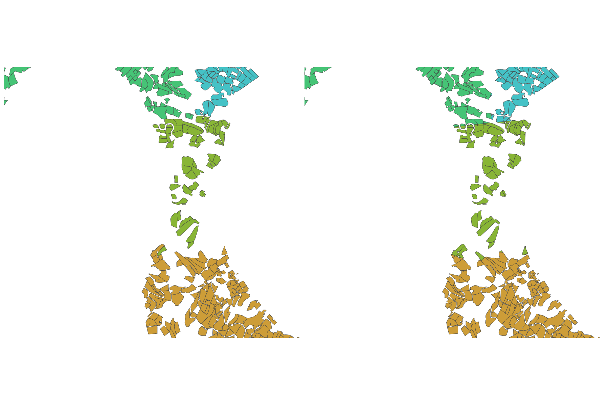

<!-- README.md is generated from README.Rmd. Please edit that file -->

# fude

<!-- badges: start -->

[](https://github.com/takeshinishimura/fude/actions/workflows/check-standard.yaml)
[](https://CRAN.R-project.org/package=fude)
<!-- badges: end -->

The fude package provides utilities to facilitate handling of Fude
Polygon data downloadable from the Ministry of Agriculture, Forestry and
Fisheries (MAFF) website. The word fude is a Japanese counter suffix
used to denote land parcels.

## Obtaining Data

Download the Fude Polygon data from the following release site of MAFF
(available only in Japanese).

- <https://open.fude.maff.go.jp>

## Installation

You can install the released version of fude from CRAN with:

``` r
install.packages("fude")
```

Or the development version from GitHub with:

``` r
# install.packages("devtools")
devtools::install_github("takeshinishimura/fude")
```

## Usage

You can allow R to read the downloaded ZIP file directly without the
need to unzip it.

``` r
library(fude)
d <- read_fude("~/2022_38.zip")
```

For those who prefer using a mouse or trackpad to select files, a method
particularly popular among R beginners, the following approach can be
taken.

``` r
d <- read_fude(file.choose())
```

You can convert the local government codes into Japanese municipality
names for more convenient management.

``` r
d2 <- rename_fude(d)
names(d2)
#>  [1] "2022_松山市"     "2022_今治市"     "2022_宇和島市"   "2022_八幡浜市"  
#>  [5] "2022_新居浜市"   "2022_西条市"     "2022_大洲市"     "2022_伊予市"    
#>  [9] "2022_四国中央市" "2022_西予市"     "2022_東温市"     "2022_上島町"    
#> [13] "2022_久万高原町" "2022_松前町"     "2022_砥部町"     "2022_内子町"    
#> [17] "2022_伊方町"     "2022_松野町"     "2022_鬼北町"     "2022_愛南町"
```

It can also be renamed to romaji instead of Japanese.

``` r
d3 <- d |> rename_fude(suffix = TRUE, romaji = "title")
names(d3)
#>  [1] "2022_Matsuyama-shi"   "2022_Imabari-shi"     "2022_Uwajima-shi"    
#>  [4] "2022_Yawatahama-shi"  "2022_Niihama-shi"     "2022_Saijo-shi"      
#>  [7] "2022_Ozu-shi"         "2022_Iyo-shi"         "2022_Shikokuchuo-shi"
#> [10] "2022_Seiyo-shi"       "2022_Toon-shi"        "2022_Kamijima-cho"   
#> [13] "2022_Kumakogen-cho"   "2022_Matsumae-cho"    "2022_Tobe-cho"       
#> [16] "2022_Uchiko-cho"      "2022_Ikata-cho"       "2022_Matsuno-cho"    
#> [19] "2022_Kihoku-cho"      "2022_Ainan-cho"
```

You can download the agricultural community boundary data, which
corresponds to the Fude Polygon data, from the MAFF website at
<https://www.maff.go.jp/j/tokei/census/shuraku_data/2020/ma/>
(onlyavailable only in Japanese).

``` r
b <- get_boundary(d)
```

You can effortlessly create a map that integrates Fude Polygons with
agricultural community boundaries.

``` r
library(ggplot2)

db <- combine_fude(d, b, city = "松山市", community = "由良|北浦|鷲ケ巣|門田|馬磯|泊|御手洗|船越")

ggplot() +
  geom_sf(data = db$fude_split, aes(fill = RCOM_NAME)) +
  guides(fill = guide_legend(reverse = TRUE, title = "興居島の集落別耕地")) +
  theme_void()
```


**出典**：農林水産省「筆ポリゴンデータ（2022年度公開）」および「農業集落境界データ（2020年度）」を加工して作成。

Polygon data close to community borders may be divided. To avoid this,
utilize `db$fude`.

``` r
library(ggforce)

ggplot() +
  geom_sf(data = db$community, fill = NA) +
  geom_sf(data = db$fude, aes(fill = RCOM_NAME)) +
  geom_mark_hull(data = db$fude, 
                 aes(x = point_lng, y = point_lat,
                     fill = RCOM_NAME,
                     label = RCOM_NAME),
                 colour = NA,
                 expand = unit(1, "mm"),
                 radius = unit(1, "mm"),
                 label.fontsize = 9,
                 label.family = "Hiragino Sans",
                 label.fill = NA,
                 label.colour = "black",
                 label.buffer = unit(4, "mm"),
                 con.colour = "gray70") +
  theme_no_axes() +
  theme(legend.position = "none")
```



**出典**：農林水産省「筆ポリゴンデータ（2022年度公開）」および「農業集落境界データ（2020年度）」を加工して作成。

Polygons situated on community boundaries are not divided but are
allocated to one of the communities. Should there be a need to adjust
this automatic assignment, custom coding will be necessary. The rows
that require consideration can be extracted with the following command.

``` r
db$fude[duplicated(db$fude_split$polygon_uuid), ]
#> Simple feature collection with 80 features and 30 fields
#> Active geometry column: geometry (with 4 geometries empty)
#> Geometry type: POLYGON
#> Dimension:     XY
#> Bounding box:  xmin: 132.6574 ymin: 33.87414 xmax: 132.6946 ymax: 33.92217
#> Geodetic CRS:  WGS 84
#> First 10 features:
#>                             polygon_uuid land_type issue_year edit_year
#> 179 95d68fa9-02c8-41c9-a273-ee30465605ff       200       2022      2020
#> 180 17a1301c-1edf-4217-a349-ff152d13cc73       200       2022      2020
#> 187 36c62d0d-444c-412b-b171-b9b6a6a274bb       200       2022      2020
#> 191 2c5e218b-bf8b-444d-85e4-d30de3e951ba       200       2022      2020
#> 204 696bd14d-a0cc-4fb5-94f6-ce73328502ed       200       2022      2020
#> 229 a422c19e-da70-47ff-848f-2d5e30f3fed9       200       2022      2020
#> 237 befbd449-9f38-40c2-8db2-32236ff368b4       200       2022      2020
#> 303 1ca420b2-6563-40ca-aae3-512e59b034de       200       2022      2020
#> 418 55bc275e-9361-4a34-8fdc-e07fa7dcac87       200       2022      2020
#> 527 81d95fa7-a821-407f-aa38-0a5b8a47b8d2       200       2022      2020
#>                                                                                                                                                               history
#> 179 [{"筆ポリゴンID":"58eb5fcb-ea9c-49f8-8d38-ae48e573f096","更新年度":2021,"前年同一":true},{"筆ポリゴンID":"58eb5fcb-ea9c-49f8-8d38-ae48e573f096","発生年度":2020}]
#> 180 [{"筆ポリゴンID":"8d856d0a-b4cc-471b-bb0d-7a386aee263a","更新年度":2021,"前年同一":true},{"筆ポリゴンID":"8d856d0a-b4cc-471b-bb0d-7a386aee263a","発生年度":2020}]
#> 187 [{"筆ポリゴンID":"17c4d96b-b7ae-4058-9c97-750961e04191","更新年度":2021,"前年同一":true},{"筆ポリゴンID":"17c4d96b-b7ae-4058-9c97-750961e04191","発生年度":2020}]
#> 191 [{"筆ポリゴンID":"9fbf0d62-5287-4036-8e5e-39448edd7d39","更新年度":2021,"前年同一":true},{"筆ポリゴンID":"9fbf0d62-5287-4036-8e5e-39448edd7d39","発生年度":2020}]
#> 204 [{"筆ポリゴンID":"2c35b35a-1a17-4631-8b65-9c3d5bd567d0","更新年度":2021,"前年同一":true},{"筆ポリゴンID":"2c35b35a-1a17-4631-8b65-9c3d5bd567d0","発生年度":2020}]
#> 229 [{"筆ポリゴンID":"3910f090-033e-4e70-b940-572916e5ada3","更新年度":2021,"前年同一":true},{"筆ポリゴンID":"3910f090-033e-4e70-b940-572916e5ada3","発生年度":2020}]
#> 237 [{"筆ポリゴンID":"079911a5-f6cd-4ea3-ac83-40f85c216a73","更新年度":2021,"前年同一":true},{"筆ポリゴンID":"079911a5-f6cd-4ea3-ac83-40f85c216a73","発生年度":2020}]
#> 303 [{"筆ポリゴンID":"ce292372-6417-432c-8350-81cd0efcae00","更新年度":2021,"前年同一":true},{"筆ポリゴンID":"ce292372-6417-432c-8350-81cd0efcae00","発生年度":2020}]
#> 418 [{"筆ポリゴンID":"91c37533-c2e4-4688-8f20-8b456fea7fef","更新年度":2021,"前年同一":true},{"筆ポリゴンID":"91c37533-c2e4-4688-8f20-8b456fea7fef","発生年度":2020}]
#> 527 [{"筆ポリゴンID":"1359d49c-7df2-4941-bbd0-789a5e7daacc","更新年度":2021,"前年同一":true},{"筆ポリゴンID":"1359d49c-7df2-4941-bbd0-789a5e7daacc","発生年度":2020}]
#>                        last_polygon_uuid prev_last_polygon_uuid
#> 179 58eb5fcb-ea9c-49f8-8d38-ae48e573f096                   <NA>
#> 180 8d856d0a-b4cc-471b-bb0d-7a386aee263a                   <NA>
#> 187 17c4d96b-b7ae-4058-9c97-750961e04191                   <NA>
#> 191 9fbf0d62-5287-4036-8e5e-39448edd7d39                   <NA>
#> 204 2c35b35a-1a17-4631-8b65-9c3d5bd567d0                   <NA>
#> 229 3910f090-033e-4e70-b940-572916e5ada3                   <NA>
#> 237 079911a5-f6cd-4ea3-ac83-40f85c216a73                   <NA>
#> 303 ce292372-6417-432c-8350-81cd0efcae00                   <NA>
#> 418 91c37533-c2e4-4688-8f20-8b456fea7fef                   <NA>
#> 527 1359d49c-7df2-4941-bbd0-789a5e7daacc                   <NA>
#>     local_government_cd point_lng point_lat land_type_jp             area
#> 179              382019  132.6890  33.91362           畑  1868.7192 [m^2]
#> 180              382019  132.6729  33.87807           畑  1864.6218 [m^2]
#> 187              382019  132.6761  33.88398           畑  1975.0378 [m^2]
#> 191              382019  132.6859  33.91254           畑  1840.4697 [m^2]
#> 204              382019  132.6831  33.90642           畑  1756.0841 [m^2]
#> 229              382019  132.6667  33.88325           畑  1696.4165 [m^2]
#> 237              382019  132.6686  33.89156           畑  1678.2258 [m^2]
#> 303              382019  132.6886  33.90552           畑   888.0173 [m^2]
#> 418              382019  132.6585  33.90284           畑 10079.5286 [m^2]
#> 527              382019  132.6875  33.90904           畑  3435.6437 [m^2]
#>                  a owner farmer        KEY PREF CITY KCITY RCOM PREF_NAME
#> 179  18.687192 [a]              3820102008   38  201    02  008    愛媛県
#> 180  18.646218 [a]              3820102002   38  201    02  002    愛媛県
#> 187  19.750378 [a]              3820102002   38  201    02  002    愛媛県
#> 191  18.404697 [a]              3820102008   38  201    02  008    愛媛県
#> 204  17.560841 [a]              3820102008   38  201    02  008    愛媛県
#> 229  16.964165 [a]              3820102002   38  201    02  002    愛媛県
#> 237  16.782258 [a]              3820102003   38  201    02  003    愛媛県
#> 303   8.880173 [a]              3820102008   38  201    02  008    愛媛県
#> 418 100.795286 [a]              3820102005   38  201    02  005    愛媛県
#> 527  34.356437 [a]              3820102008   38  201    02  008    愛媛県
#>     CITY_NAME KCITY_NAME RCOM_NAME RCOM_KANA HININTEI boundary_edit_year
#> 179    松山市   興居島村      門田    かどた        0               2020
#> 180    松山市   興居島村        泊    とまり        0               2020
#> 187    松山市   興居島村        泊    とまり        0               2020
#> 191    松山市   興居島村      門田    かどた        0               2020
#> 204    松山市   興居島村      門田    かどた        0               2020
#> 229    松山市   興居島村        泊    とまり        0               2020
#> 237    松山市   興居島村      船越  ふなこし        0               2020
#> 303    松山市   興居島村      門田    かどた        0               2020
#> 418    松山市   興居島村    鷲ケ巣  わしがす        0               2020
#> 527    松山市   興居島村      門田    かどた        0               2020
#>     RCOM_romaji        x        y                       geometry
#> 179      Kadota 132.6865 33.91249 POLYGON ((132.6889 33.91384...
#> 180      Tomari 132.6745 33.88193 POLYGON ((132.6726 33.87832...
#> 187      Tomari 132.6745 33.88193 POLYGON ((132.676 33.88372,...
#> 191      Kadota 132.6865 33.91249 POLYGON ((132.6856 33.91279...
#> 204      Kadota 132.6865 33.91249 POLYGON ((132.6829 33.90642...
#> 229      Tomari 132.6745 33.88193 POLYGON ((132.6667 33.88354...
#> 237   Funakoshi 132.6706 33.89536 POLYGON ((132.6687 33.89186...
#> 303      Kadota 132.6865 33.91249 POLYGON ((132.6887 33.90569...
#> 418   Washigasu 132.6637 33.90494 POLYGON ((132.6577 33.90273...
#> 527      Kadota 132.6865 33.91249 POLYGON ((132.6879 33.90909...
#>                      centroid
#> 179 POINT (132.6865 33.91249)
#> 180 POINT (132.6745 33.88193)
#> 187 POINT (132.6745 33.88193)
#> 191 POINT (132.6865 33.91249)
#> 204 POINT (132.6865 33.91249)
#> 229 POINT (132.6745 33.88193)
#> 237 POINT (132.6706 33.89536)
#> 303 POINT (132.6865 33.91249)
#> 418 POINT (132.6637 33.90494)
#> 527 POINT (132.6865 33.91249)
```

The gghighlight package allows for a wider range of expression.

``` r
library(gghighlight)
library(forcats)

db$community$RCOM_NAME <- forcats::fct_rev(db$community$RCOM_NAME)
db$fude$RCOM_NAME <- forcats::fct_rev(db$fude$RCOM_NAME)

ggplot() +
  geom_sf(data = db$community, aes(fill = RCOM_NAME), alpha = 0) +
  geom_sf(data = db$fude, aes(fill = RCOM_NAME), linewidth = 0) +
  gghighlight() +
  facet_wrap(vars(RCOM_NAME)) +
  theme_void() +
  theme(legend.position = "none",
        text = element_text(family = "Hiragino Sans"))
```


**Source**: Created by processing the Ministry of Agriculture, Forestry
and Fisheries, *Fude Polygon Data (released in FY2022)* and
*Agricultural Community Boundary Data (FY2020)*.

``` r
ggplot(data = db$fude, aes(x = as.numeric(a), fill = land_type_jp)) +
  geom_histogram(position = "identity", alpha = .5) +
  labs(x = "面積（a）",
       y = "頻度") +
  facet_wrap(vars(RCOM_NAME)) +
  labs(fill = "耕地の種類") +
  theme_minimal() +
  theme(legend.position = "none",
        text = element_text(family = "Hiragino Sans"))
```


There are 8 types of objects obtained by `combine_fude()` as follows.

``` r
names(db)
#> [1] "fude"            "fude_split"      "community"       "community_union"
#> [5] "ov"              "lg"              "pref"            "source"
```

If you want to be particular about the details of the map, for example,
execute the following code.

``` r
library(ggrepel)
library(cowplot)

db <- combine_fude(d, b, city = "松山市", old_village = "興居島", community = "^(?!釣島).*")

minimap <- ggplot() +
  geom_sf(data = db$lg, aes(fill = fill)) +
  geom_sf_text(data = db$lg, aes(label = city_kanji), family = "Hiragino Sans") +
  gghighlight(fill == 1) +
  geom_sf(data = db$community_union, fill = "black", linewidth = 0) +
  theme_void() +
  theme(panel.background = element_rect(fill = "aliceblue")) +
  scale_fill_manual(values = c("white", "gray"))

mainmap <- ggplot() +
  geom_sf(data = db$community, fill = "white") +
  geom_sf(data = db$fude, aes(fill = RCOM_NAME)) +
  geom_point(data = db$community, aes(x = x, y = y), colour = "gray") +
  geom_text_repel(data = db$community,
                  aes(x = x, y = y, label = RCOM_NAME),
                  nudge_x = c(-.01, .01, -.01, -.012, .005, -.01, .01, .01),
                  nudge_y = c(.005, .005, 0, .01, -.005, .01, 0, -.005),
                  min.segment.length = .01,
                  segment.color = "gray",
                  size = 3,
                  family = "Hiragino Sans") +
  theme_void() +
  theme(legend.position = "none")

ggdraw(mainmap) +
  draw_plot(
    {minimap +
       geom_rect(aes(xmin = 132.47, xmax = 133.0,
                     ymin = 33.72, ymax = 34.05),
                 fill = NA,
                 colour = "black",
                 size = .5) +
       coord_sf(xlim = c(132.47, 133.0),
                ylim = c(33.72, 34.05),
                expand = FALSE) +
       theme(legend.position = "none")
    },
    x = .7, 
    y = 0,
    width = .3, 
    height = .3)
```

This package may be beneficial, especially for R beginners, when simply
wanting to draw agricultural community boundaries.

``` r
library(dplyr)
library(ggrepel)

db <- combine_fude(d, b, city = "西予市", old_village = "遊子川")

ggplot() +
  geom_sf(data = db$pref, fill = NA) +
  geom_sf(data = db$lg, fill = "gray") +
  gghighlight(fill == 1,
    unhighlighted_params = list(
      alpha = .05
    )) +
  geom_sf(data = db$ov |> filter(fill == 1), colour = NA, fill = "black") +
  geom_sf_text(data = db$lg |> filter(fill == 1),
               aes(label = city_kanji),
               size = 3,
               nudge_x = -.025, nudge_y = -.025,
               family = "Hiragino Sans") +
  geom_point(data = db$community_union, aes(x = x, y = y), colour = "black") +
  geom_text_repel(data = db$community_union,
                  aes(x = x, y = y),
                  label = "遊子川地区",
                  nudge_x = .3, nudge_y = -.025,
                  segment.color = "black",
                  size = 3,
                  family = "Hiragino Sans") +
  theme_void()
```


**出典**：農林水産省「筆ポリゴンデータ（2022年度公開）」および「農業集落境界データ（2020年度）」を加工して作成。

If you want to use `mapview()`, do the following.

``` r
library(mapview)

db1 <- combine_fude(d, b, city = "伊方町")
db2 <- combine_fude(d, b, city = "八幡浜市")
db3 <- combine_fude(d, b, city = "西予市", old_village = "三瓶|二木生|三島|双岩")
db <- bind_fude(db1, db2, db3)

mapview::mapview(db$fude, zcol = "RCOM_NAME", layer.name = "農業集落名")
```
