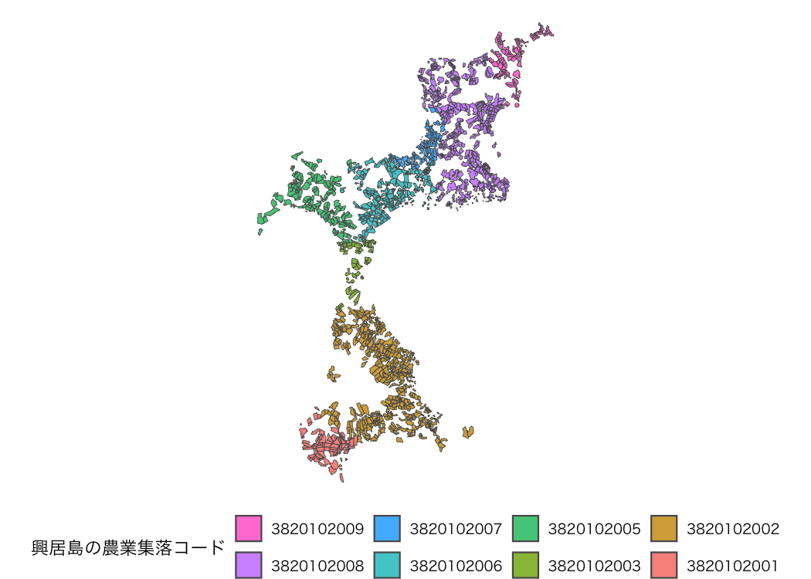

<!-- README.md is generated from README.Rmd. Please edit that file -->

# fude

<!-- badges: start -->

[](https://github.com/takeshinishimura/fude/actions/workflows/check-standard.yaml)
[](https://CRAN.R-project.org/package=fude)
<!-- badges: end -->

The fude package provides utilities to facilitate the handling of the
Fude Polygon data downloadable from the Ministry of Agriculture,
Forestry and Fisheries (MAFF) website. The word “fude” is a Japanese
counter suffix used to denote land parcels.

## Obtaining Data

Fude Polygon data can now be downloaded from two different MAFF websites
(both available only in Japanese):

1.  **GeoJSON format**:  
    <https://open.fude.maff.go.jp>

2.  **FlatGeobuf format**:  
    <https://www.maff.go.jp/j/tokei/census/shuraku_data/2020/mb/>

## Installation

You can install the released version of fude from CRAN with:

``` r
install.packages("fude")
```

Or the development version from GitHub with:

``` r
# install.packages("devtools")
devtools::install_github("takeshinishimura/fude")
```

## Usage

### Reading Fude Polygon Data

There are two ways to load Fude Polygon data, depending on how the data
was obtained:

1.  **From a locally saved ZIP file**:  
    This method works for both GeoJSON (from Obtaining Data \#1) and
    FlatGeobuf (from Obtaining Data \#2) formats. You can load a ZIP
    file saved on your computer without unzipping it.

``` r
library(fude)
d <- read_fude("~/2022_38.zip")
```

2.  **By specifying a prefecture name or code**: This method is
    available only for FlatGeobuf data (from Obtaining Data \#2).
    Provide the name of a prefecture (e.g., “愛媛”) or its corresponding
    prefecture code (e.g., “38”), and the required FlatGeobuf format ZIP
    file will be automatically downloaded and loaded.

``` r
d2 <- read_fude(pref = "愛媛")
#> Reading layer `MB0001_2024_2020_38' from data source 
#>   `/private/var/folders/33/1nmp7drn6c56394qxrzb2cth0000gn/T/RtmpHNW56H/file169653e2a4e36/MB0001_2024_2020_38/MB0001_2024_2020_38.fgb' 
#>   using driver `FlatGeobuf'
#> Simple feature collection with 632287 features and 6 fields
#> Geometry type: MULTIPOLYGON
#> Dimension:     XY
#> Bounding box:  xmin: 132.0215 ymin: 32.9103 xmax: 133.6916 ymax: 34.29884
#> Geodetic CRS:  JGD2000
```

### Renaming the Local Government Code

**Note:** This feature is available only for data obtained from GeoJSON
(Obtaining Data \#1).

Convert local government codes into Japanese municipality names for
easier management.

``` r
dren <- rename_fude(d)
names(dren)
#>  [1] "2022_松山市"     "2022_今治市"     "2022_宇和島市"   "2022_八幡浜市"  
#>  [5] "2022_新居浜市"   "2022_西条市"     "2022_大洲市"     "2022_伊予市"    
#>  [9] "2022_四国中央市" "2022_西予市"     "2022_東温市"     "2022_上島町"    
#> [13] "2022_久万高原町" "2022_松前町"     "2022_砥部町"     "2022_内子町"    
#> [17] "2022_伊方町"     "2022_松野町"     "2022_鬼北町"     "2022_愛南町"
```

You can also rename the columns to Romaji instead of Japanese.

``` r
dren <- d |> rename_fude(suffix = TRUE, romaji = "title")
names(dren)
#>  [1] "2022_Matsuyama-shi"   "2022_Imabari-shi"     "2022_Uwajima-shi"    
#>  [4] "2022_Yawatahama-shi"  "2022_Niihama-shi"     "2022_Saijo-shi"      
#>  [7] "2022_Ozu-shi"         "2022_Iyo-shi"         "2022_Shikokuchuo-shi"
#> [10] "2022_Seiyo-shi"       "2022_Toon-shi"        "2022_Kamijima-cho"   
#> [13] "2022_Kumakogen-cho"   "2022_Matsumae-cho"    "2022_Tobe-cho"       
#> [16] "2022_Uchiko-cho"      "2022_Ikata-cho"       "2022_Matsuno-cho"    
#> [19] "2022_Kihoku-cho"      "2022_Ainan-cho"
```

### Getting Agricultural Community Boundary Data

Download the agricultural community boundary data, which corresponds to
the Fude Polygon data, from the MAFF website:
<https://www.maff.go.jp/j/tokei/census/shuraku_data/2020/ma/> (available
only in Japanese).

``` r
b <- get_boundary(d)
```

### Combining Fude Polygons with Agricultural Community Boundaries

You can easily combine Fude Polygons with agricultural community
boundaries to create enriched spatial analyses or maps.

#### Characteristics of Data from GeoJSON (Obtaining Data \#1)

``` r
db <- combine_fude(d, b, city = "松山市", community = "由良|北浦|鷲ケ巣|門田|馬磯|泊|御手洗|船越")

library(ggplot2)

ggplot() +
  geom_sf(data = db$fude, aes(fill = RCOM_NAME), alpha = .8) +
  guides(fill = guide_legend(reverse = TRUE, title = "興居島の集落別耕地")) +
  theme_void() +
  theme(legend.position = "bottom") +
  theme(text = element_text(family = "Hiragino Sans"))
```


**出典**：農林水産省「筆ポリゴンデータ（2022年度公開）」および「農業集落境界データ（2020年度）」を加工して作成。

##### Data Assignment

- `db$fude`: Automatically assigns polygons on the boundaries to a
  community.
- `db$fude_split`: Provides cleaner boundaries, but polygon data near
  community borders may be divided.

``` r
library(patchwork)

fude <- ggplot() +
  geom_sf(data = db$fude, aes(fill = RCOM_NAME), alpha = .8) +
  theme_void() +
  theme(legend.position = "none") +
  coord_sf(xlim = c(132.658, 132.678), ylim = c(33.887, 33.902))

fude_split <- ggplot() +
  geom_sf(data = db$fude_split, aes(fill = RCOM_NAME), alpha = .8) +
  theme_void() +
  theme(legend.position = "none") +
  coord_sf(xlim = c(132.658, 132.678), ylim = c(33.887, 33.902))

fude + fude_split
```


If you need to adjust this automatic assignment, you will need to write
custom code. The rows that require attention can be identified with the
following command.

``` r
# head(sf::st_drop_geometry(db$fude[db$fude$polygon_uuid %in% db$fude_split$polygon_uuid[duplicated(db$fude_split$polygon_uuid)], c("polygon_uuid", "PREF_NAME", "CITY_NAME", "KCITY_NAME", "RCOM_NAME", "RCOM_KANA", "RCOM_ROMAJI")]))
library(dplyr)
library(sf)

db$fude |>
  filter(polygon_uuid %in% (db$fude_split |> filter(duplicated(polygon_uuid)) |> pull(polygon_uuid))) |>
  st_drop_geometry() |>
  select(polygon_uuid, KCITY_NAME, RCOM_NAME, RCOM_KANA, RCOM_ROMAJI) |>
  head()
#>                           polygon_uuid KCITY_NAME RCOM_NAME RCOM_KANA
#> 1 8085bc47-9af5-440f-89e9-f188d3b95746   興居島村        泊    とまり
#> 2 26920da0-b63e-4994-a9eb-175e2982fe21   興居島村      門田    かどた
#> 3 ac2e7293-6c2f-4feb-a95f-4729dc8d0aec   興居島村      由良      ゆら
#> 4 ea130038-7035-4cf3-b71c-091783090d74   興居島村      船越  ふなこし
#> 5 4aba8229-1b14-4eab-8a91-e10d9e841180   興居島村      船越  ふなこし
#> 6 156a3459-25cb-494c-824f-9ba6b0fb6f23   興居島村      由良      ゆら
#>   RCOM_ROMAJI
#> 1      Tomari
#> 2      Kadota
#> 3        Yura
#> 4   Funakoshi
#> 5   Funakoshi
#> 6        Yura
```

#### Characteristics of Data from FlatGeobuf (Obtaining Data \#2)

The FlatGeobuf format offers a more efficient alternative to GeoJSON. A
notable feature of this format is that each record already includes an
**accurately assigned agricultural community code**.

``` r
db2 <- combine_fude(d2, b, city = "松山市", community = "由良|北浦|鷲ケ巣|門田|馬磯|泊|御手洗|船越")

ggplot() +
  geom_sf(data = db2$fude, aes(fill = key), alpha = .8) +
  guides(fill = guide_legend(reverse = TRUE, title = "興居島の農業集落コード")) +
  theme_void() +
  theme(legend.position = "bottom") +
  theme(text = element_text(family = "Hiragino Sans"))
```



**出典**：農林水産省「筆ポリゴンデータ（2022年度公開）」および「農業集落境界データ（2020年度）」を加工して作成。

### Review Fude Polygon Data

You can review Fude Polygon data in detail.

``` r
library(shiny)

s <- shiny_fude(db, community = TRUE)
# shiny::shinyApp(ui = s$ui, server = s$server)
```

This feature was heavily inspired by the following website:
<https://brendenmsmith.com/blog/shiny_map_filter/>.

### Using `mapview` package

If you want to use `mapview()`, do the following.

``` r
db1 <- combine_fude(d, b, city = "伊方町")
db2 <- combine_fude(d, b, city = "八幡浜市")
db3 <- combine_fude(d, b, city = "西予市", kcity = "三瓶|二木生|三島|双岩")

db <- bind_fude(db1, db2, db3)

library(mapview)

mapview::mapview(db$fude, zcol = "RCOM_NAME", layer.name = "農業集落名")
```
