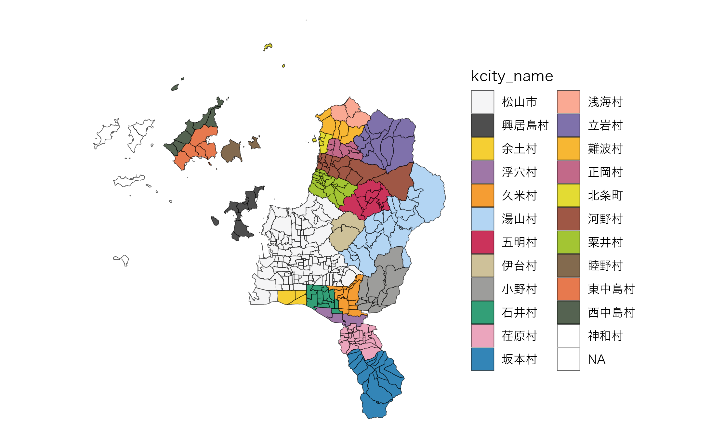

# Structure of combined Fude Polygon data with agricultural community boundary data

## Structure of combined Fude Polygon data with agricultural community boundary data

``` r
library(fude)

d <- read_fude("~/2022_38.zip", quiet = TRUE, supplementary = TRUE)
b <- get_boundary(d, path = "~", crs = 4326, quiet = TRUE)
db <- combine_fude(d, b, city = "松山市", kcity = "浅海")
```

There are 7 types of objects obtained by
[`combine_fude()`](https://takeshinishimura.github.io/fude/reference/combine_fude.md),
as follows:

``` r
names(db)
```

    ## [1] "fude"       "fude_split" "rcom"       "rcom_union" "kcity"     
    ## [6] "city"       "pref"

## Possible values for `rcom` in `combine_fude()` and `extract_boundary()`

``` r
library(dplyr)
library(data.tree)

tree <- b[[1]] |>
  filter(grepl("松山", kcity_name)) |>
  mutate(pathString = paste(pref_name, city_name, kcity_name, rcom_name, sep = "/")) |>
  data.tree::as.Node()

tree$Do(\(x) {x$n <- if (x$isLeaf) NA_integer_ else x$count})
data.tree::SetFormat(tree, "n", \(x) if (is.na(x)) "-" else x)
print(tree, "n", limit = 30)
```

    ##                             levelName   n
    ## 1  愛媛県                               1
    ## 2   °--松山市                          1
    ## 3       °--松山市                    108
    ## 4           ¦--土居田                  -
    ## 5           ¦--針田                    -
    ## 6           ¦--小栗第１                -
    ## 7           ¦--小栗第２                -
    ## 8           ¦--小栗第３                -
    ## 9           ¦--藤原第１                -
    ## 10          ¦--藤原第２                -
    ## 11          ¦--竹原東                  -
    ## 12          ¦--竹原西                  -
    ## 13          ¦--生石南                  -
    ## 14          ¦--生石北                  -
    ## 15          ¦--八代                    -
    ## 16          ¦--南味酒                  -
    ## 17          ¦--南江戸                  -
    ## 18          ¦--朝美１                  -
    ## 19          ¦--朝美２                  -
    ## 20          ¦--朝美３                  -
    ## 21          ¦--宮西                    -
    ## 22          ¦--六軒家                  -
    ## 23          ¦--衣山                    -
    ## 24          ¦--萱町９                  -
    ## 25          ¦--山越                    -
    ## 26          ¦--姫原                    -
    ## 27          ¦--御幸寺                  -
    ## 28          ¦--本町９                  -
    ## 29          ¦--本町８                  -
    ## 30          °--... 82 nodes w/ 0 sub   -

``` r
library(ggplot2)

ggplot(data = b[[1]] |> filter(grepl("松山", kcity_name))) + 
  geom_sf(fill = NA) +
  geom_sf_text(aes(label = rcom_name), size = 2, family = "Hiragino Sans") +
  theme_void()
```


**出典**：農林水産省「農業集落境界データ（2020年度）」を加工して作成。

``` r
library(collapsibleTree)

b[[1]] |>
  filter(grepl("松山", city_name)) |>
  distinct(pref_name, city_name, kcity_name, rcom_name) |>
  (\(x) collapsibleTree(
    x,
    hierarchy = names(x),
    root = "・"
  ))()
```

## Possible values for `kcity` in `combine_fude()` and `extract_boundary()`

``` r
library(paletteer)

ggplot(b[[1]] |> filter(city_name == "松山市")) +
  geom_sf(aes(fill = kcity_name), alpha = .8) +
  theme_void() +
  theme(text = element_text(family = "Hiragino Sans")) +
  paletteer::scale_fill_paletteer_d("Polychrome::kelly")
```



**出典**：農林水産省「農業集落境界データ（2020年度）」を加工して作成。
