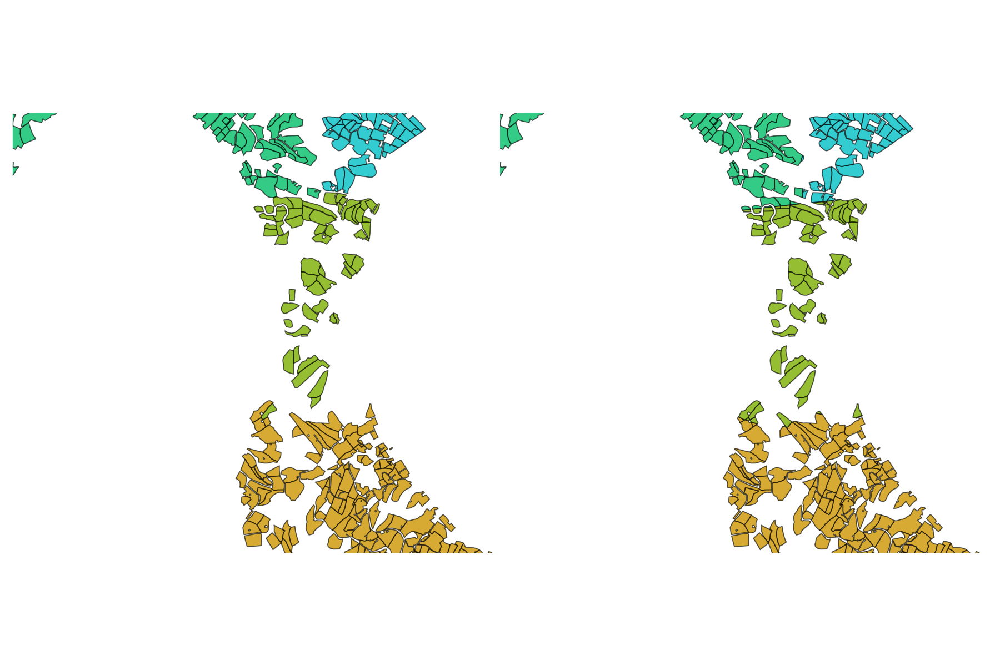
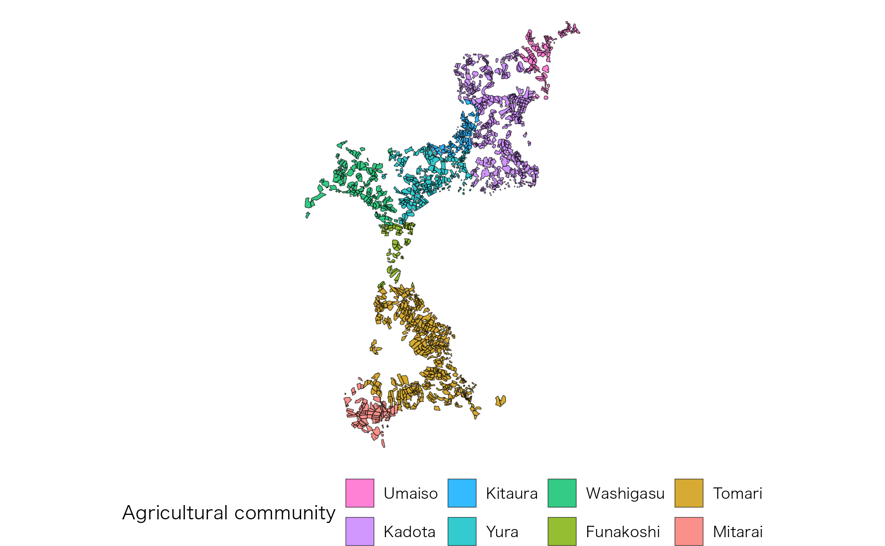

# Structure of combined Fude Polygon data with agricultural community boundary data

## Structure of combined Fude Polygon data with agricultural community boundary data

``` r
library(fude)

d <- read_fude("~/2022_38.zip", quiet = TRUE, supplementary = TRUE)
b <- get_boundary(d, path = "~", quiet = TRUE)

d2 <- read_fude("~/MB0001_2025_2020_38.zip", quiet = TRUE)
```

### GeoJSON data characteristics (obtain data \#1)

``` r
library(sf)

db <- d |>
  lapply(st_transform, crs = 4612) |>
  combine_fude(b, city = "松山市", rcom = "由良|北浦|鷲ケ巣|門田|馬磯|泊|御手洗|船越")
```

There are 7 types of objects obtained by
[`combine_fude()`](https://takeshinishimura.github.io/fude/reference/combine_fude.md),
as follows:

``` r
names(db)
```

    ## [1] "fude"       "fude_split" "rcom"       "rcom_union" "kcity"     
    ## [6] "city"       "pref"

``` r
library(ggplot2)

ggplot() +
  geom_sf(data = db$fude, aes(fill = rcom_romaji), alpha = .8) +
  guides(fill = guide_legend(reverse = TRUE, title = "Agricultural community")) +
  theme_void() +
  theme(legend.position = "bottom") +
  theme(text = element_text(family = "Hiragino Sans"))
```


**Source**: Created by processing data from the Ministry of Agriculture,
Forestry and Fisheries, “Fude Polygon Data (released in FY 2022)” and
“Agricultural Community Boundary Data (FY 2020)”.

#### Data assignment

- `db$fude`: Automatically assigns polygons on the boundaries to a
  community.
- `db$fude_split`: Provides cleaner boundaries, but polygon data near
  community borders may be divided.

``` r
library(patchwork)

fude <- ggplot() +
  geom_sf(data = db$fude, aes(fill = rcom_romaji), alpha = .8) +
  theme_void() +
  theme(legend.position = "none") +
  coord_sf(xlim = c(132.658, 132.678), ylim = c(33.887, 33.902))

fude_split <- ggplot() +
  geom_sf(data = db$fude_split, aes(fill = rcom_romaji), alpha = .8) +
  theme_void() +
  theme(legend.position = "none") +
  coord_sf(xlim = c(132.658, 132.678), ylim = c(33.887, 33.902))

fude + fude_split
```



**Source**: Created by processing data from the Ministry of Agriculture,
Forestry and Fisheries, “Fude Polygon Data (released in FY 2022)” and
“Agricultural Community Boundary Data (FY 2020)”.

If you need to adjust this automatic assignment, you will need to write
custom code. The rows that require attention can be identified with the
following command.

``` r
library(dplyr)

db$fude |>
  filter(polygon_uuid %in% (db$fude_split |> filter(duplicated(polygon_uuid)) |> pull(polygon_uuid))) |>
  st_drop_geometry() |>
  select(polygon_uuid, kcity_name, rcom_name, rcom_romaji) |>
  head()
```

    ## # A tibble: 6 × 4
    ##   polygon_uuid                         kcity_name rcom_name rcom_romaji
    ##   <chr>                                <fct>      <fct>     <fct>      
    ## 1 8085bc47-9af5-440f-89e9-f188d3b95746 興居島村   泊        Tomari     
    ## 2 26920da0-b63e-4994-a9eb-175e2982fe21 興居島村   門田      Kadota     
    ## 3 ac2e7293-6c2f-4feb-a95f-4729dc8d0aec 興居島村   由良      Yura       
    ## 4 ea130038-7035-4cf3-b71c-091783090d74 興居島村   船越      Funakoshi  
    ## 5 4aba8229-1b14-4eab-8a91-e10d9e841180 興居島村   船越      Funakoshi  
    ## 6 156a3459-25cb-494c-824f-9ba6b0fb6f23 興居島村   由良      Yura

### FlatGeobuf data characteristics (obtain data \#2)

The FlatGeobuf format offers a more efficient alternative to GeoJSON. A
notable feature of this format is that each record already includes an
**accurately assigned agricultural community code**.

``` r
db <- combine_fude(d2, b, city = "松山市", rcom = "由良|北浦|鷲ケ巣|門田|馬磯|泊|御手洗|船越")

ggplot() +
  geom_sf(data = db$fude, aes(fill = rcom_romaji), alpha = .8) +
  guides(fill = guide_legend(reverse = TRUE, title = "Agricultural community")) +
  theme_void() +
  theme(legend.position = "bottom") +
  theme(text = element_text(family = "Hiragino Sans"))
```



**Source**: Created by processing data from the Ministry of Agriculture,
Forestry and Fisheries, “Fude Polygon Data (released in FY 2025)” and
“Agricultural Community Boundary Data (FY 2020)”.

## Possible values for `rcom` in `combine_fude()` and `extract_boundary()`

``` r
library(data.tree)

tree <- b[[1]] |>
  filter(grepl("松山", kcity_name)) |>
  mutate(pathString = paste(pref_name, city_name, kcity_name, rcom_name, sep = "/")) |>
  data.tree::as.Node()

tree$Do(\(x) {x$n <- if (x$isLeaf) NA_integer_ else x$count})
data.tree::SetFormat(tree, "n", \(x) if (is.na(x)) "-" else x)
print(tree, "n", limit = 30)
```

    ##                             levelName   n
    ## 1  愛媛県                               1
    ## 2   °--松山市                          1
    ## 3       °--松山市                    108
    ## 4           ¦--土居田                  -
    ## 5           ¦--針田                    -
    ## 6           ¦--小栗第１                -
    ## 7           ¦--小栗第２                -
    ## 8           ¦--小栗第３                -
    ## 9           ¦--藤原第１                -
    ## 10          ¦--藤原第２                -
    ## 11          ¦--竹原東                  -
    ## 12          ¦--竹原西                  -
    ## 13          ¦--生石南                  -
    ## 14          ¦--生石北                  -
    ## 15          ¦--八代                    -
    ## 16          ¦--南味酒                  -
    ## 17          ¦--南江戸                  -
    ## 18          ¦--朝美１                  -
    ## 19          ¦--朝美２                  -
    ## 20          ¦--朝美３                  -
    ## 21          ¦--宮西                    -
    ## 22          ¦--六軒家                  -
    ## 23          ¦--衣山                    -
    ## 24          ¦--萱町９                  -
    ## 25          ¦--山越                    -
    ## 26          ¦--姫原                    -
    ## 27          ¦--御幸寺                  -
    ## 28          ¦--本町９                  -
    ## 29          ¦--本町８                  -
    ## 30          °--... 82 nodes w/ 0 sub   -

``` r
ggplot(data = b[[1]] |> filter(grepl("松山", kcity_name))) + 
  geom_sf(fill = NA) +
  geom_sf_text(aes(label = rcom_name), size = 2, family = "Hiragino Sans") +
  theme_void()
```


**出典**：農林水産省「農業集落境界データ（2020年度）」を加工して作成。

``` r
library(collapsibleTree)

b[[1]] |>
  filter(grepl("松山", city_name)) |>
  distinct(pref_name, city_name, kcity_name, rcom_name) |>
  (\(x) collapsibleTree(
    x,
    hierarchy = names(x),
    root = "・"
  ))()
```

## Possible values for `kcity` in `combine_fude()` and `extract_boundary()`

``` r
library(paletteer)

ggplot(b[[1]] |> filter(city_name == "松山市")) +
  geom_sf(aes(fill = kcity_name), alpha = .8) +
  theme_void() +
  theme(text = element_text(family = "Hiragino Sans")) +
  paletteer::scale_fill_paletteer_d("Polychrome::kelly")
```


**出典**：農林水産省「農業集落境界データ（2020年度）」を加工して作成。
