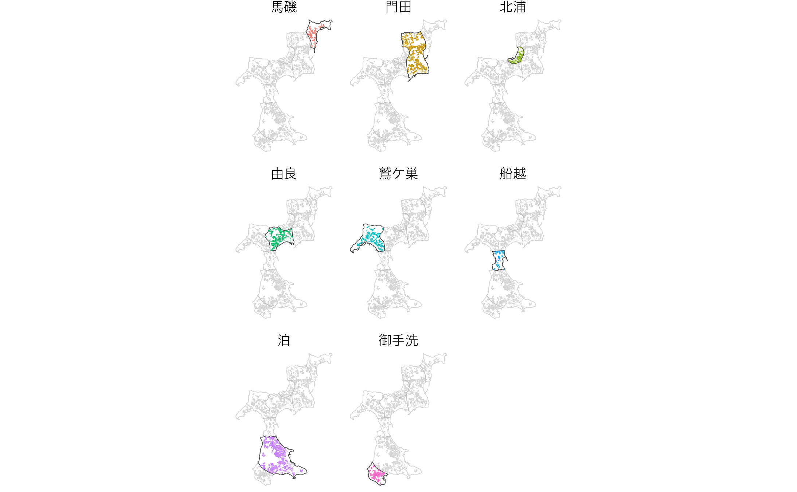
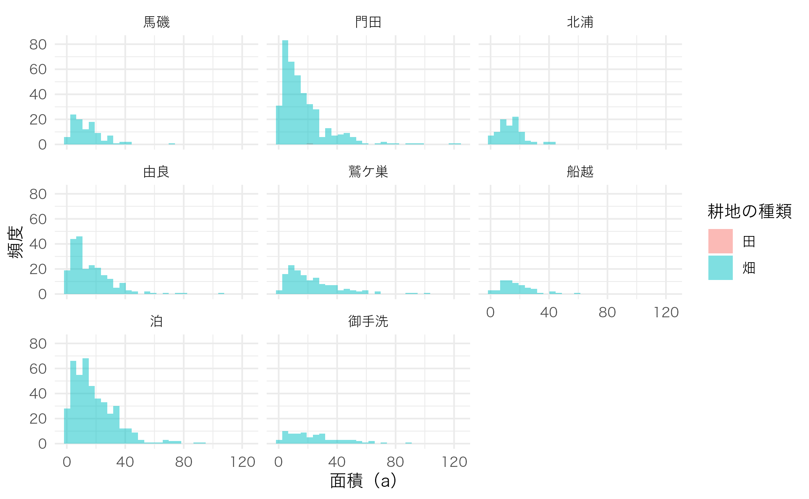

# Using \`gghighlight\` Package

## Using `gghighlight` package

``` r
library(dplyr)
library(forcats)
library(ggplot2)
library(gghighlight)

db <- combine_fude(d, b, city = "松山市", kcity = "興居島", community = "^(?!釣島)")

db$community <- db$community |>
  mutate(across(c(RCOM_NAME, RCOM_KANA, RCOM_ROMAJI), forcats::fct_rev))
db$fude <- db$fude |>
  mutate(across(c(RCOM_NAME, RCOM_KANA, RCOM_ROMAJI), forcats::fct_rev))

ggplot() +
  geom_sf(data = db$community, aes(fill = RCOM_NAME), alpha = 0) +
  geom_sf(data = db$fude, aes(fill = RCOM_NAME), linewidth = 0) +
  gghighlight() +
  facet_wrap(~ RCOM_NAME) +
  theme_void() +
  theme(
    legend.position = "none",
    text = element_text(family = "Hiragino Sans")
  )
```



**出典**：農林水産省「筆ポリゴンデータ（2025年度公開）」および「農業集落境界データ（2020年度）」を加工して作成。

``` r
ggplot(data = db$fude, aes(x = a, fill = land_type_jp)) +
  geom_histogram(position = "identity", alpha = .5) +
  labs(x = "面積（a）",
       y = "頻度") +
  facet_wrap(~ RCOM_NAME) +
  labs(fill = "耕地の種類") +
  theme_minimal() +
  theme(text = element_text(family = "Hiragino Sans"))
```


