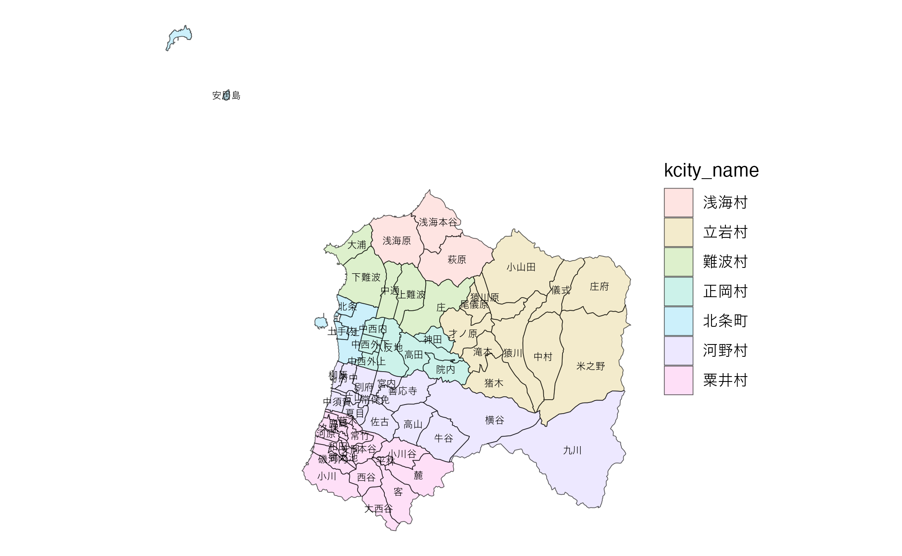
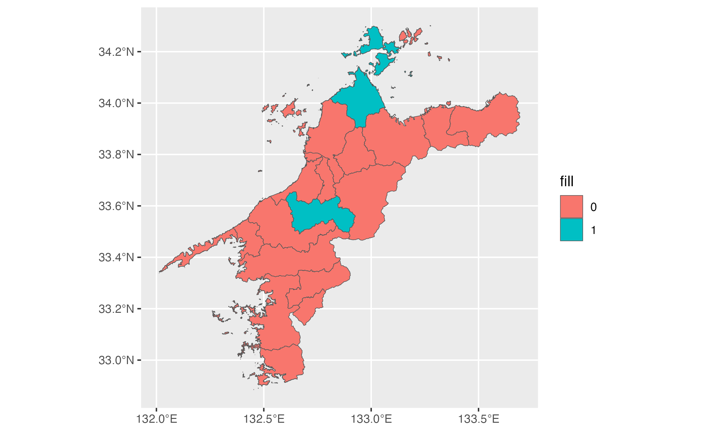
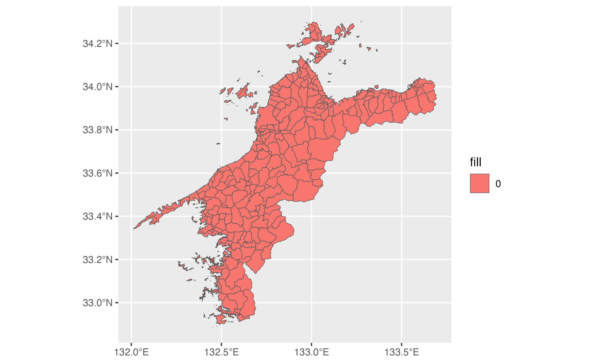
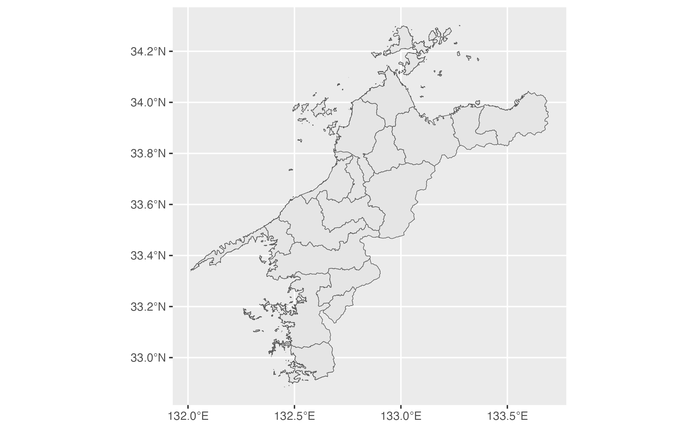
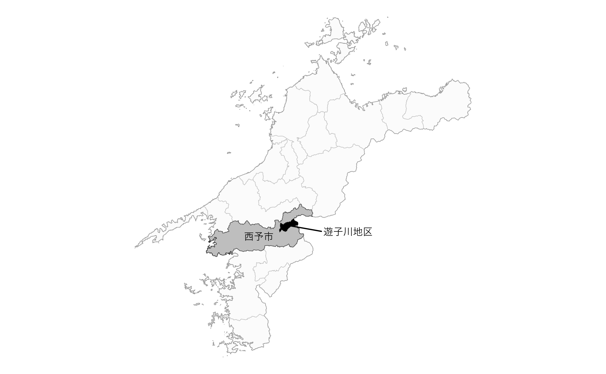
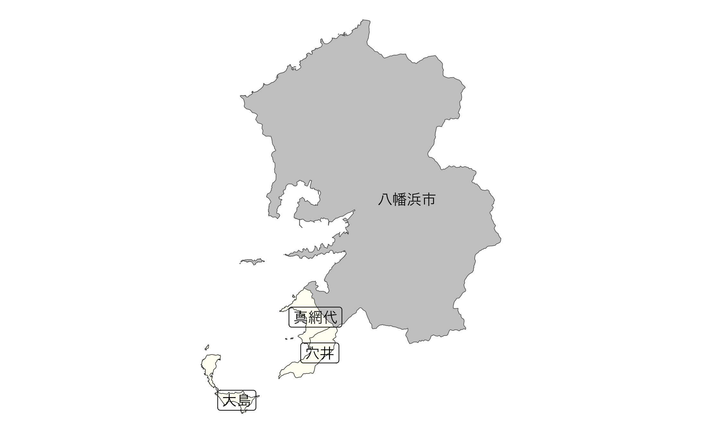

# Drawing agricultural community boundaries

## Drawing agricultural community boundaries

This package may be beneficial, especially for R beginners, when simply
wanting to draw agricultural community boundaries.

``` r
library(dplyr)
library(ggplot2)
library(gghighlight)
library(ggrepel)

b <- get_boundary("38", path = "~", quiet = TRUE)
eb <- extract_boundary(b, city = "松山市", kcity = "浅海|立岩|難波|正岡|北条|河野|粟井")

ggplot(data = eb, aes(fill = KCITY_NAME)) +
  geom_sf(alpha = .2) +
  geom_sf_text(aes(label = RCOM_NAME), size = 2, family = "Hiragino Sans") +
  theme_void() +
  theme(legend.position = "none")
```



**出典**：農林水産省「農業集落境界データ（2020年度）」を加工して作成。

``` r
eb <- extract_boundary(b, city = "今治|内子", layer = TRUE)

ggplot(data = eb$city) +
  geom_sf(aes(fill = fill))
```



``` r
ggplot(data = eb$kcity) +
  geom_sf(aes(fill = fill))
```



``` r
ggplot(data = eb$city) +
  geom_sf() +
  geom_sf(data = eb$rcom)
```



**出典**：農林水産省「農業集落境界データ（年度）」を加工して作成。

``` r
eb <- extract_boundary(b, city = "西予市", kcity = "遊子川", layer = TRUE)

ggplot() +
  geom_sf(data = eb$pref, fill = NA) +
  geom_sf(data = eb$city, fill = "gray") +
  gghighlight(fill == 1,
    unhighlighted_params = list(
      alpha = .05
    )) +
  geom_sf(data = eb$kcity |> filter(fill == 1), fill = "black") +
  geom_sf_text(
    data = eb$city |> filter(fill == 1),
    aes(label = city_kanji),
    size = 3,
    nudge_x = -.025, nudge_y = -.025,
    family = "HiraKakuProN-W3"
  ) +
  geom_point(data = eb$rcom_union, aes(x = x, y = y), colour = "black") +
  geom_text_repel(
    data = eb$rcom_union,
    aes(x = x, y = y),
    label = "遊子川地区",
    nudge_x = .3, nudge_y = -.025,
    segment.color = "black",
    size = 3,
    family = "HiraKakuProN-W3"
  ) +
  theme_void()
```



**出典**：農林水産省「農業集落境界データ（2020年度）」を加工して作成。

``` r
eb <- extract_boundary(b, city = "八幡浜市", kcity = "真穴", layer = TRUE)

ggplot(data = eb$city |> filter(fill == 1)) +
  geom_sf(fill = "gray") +
  geom_sf_text(aes(label = city_kanji), family = "HiraKakuProN-W3") +
  geom_sf(data = eb$rcom, fill = "ivory") +
# geom_sf(data = eb$fude, aes(fill = land_type), colour = NA) +
  geom_sf_label(data = eb$rcom, aes(label = RCOM_NAME), family = "HiraKakuProN-W3") +
  theme_void() +
  theme(legend.position = "none")
```



**出典**：農林水産省「農業集落境界データ（2020年度）」を加工して作成。
