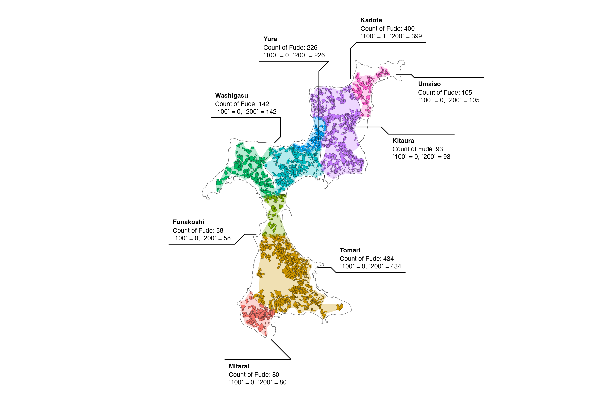
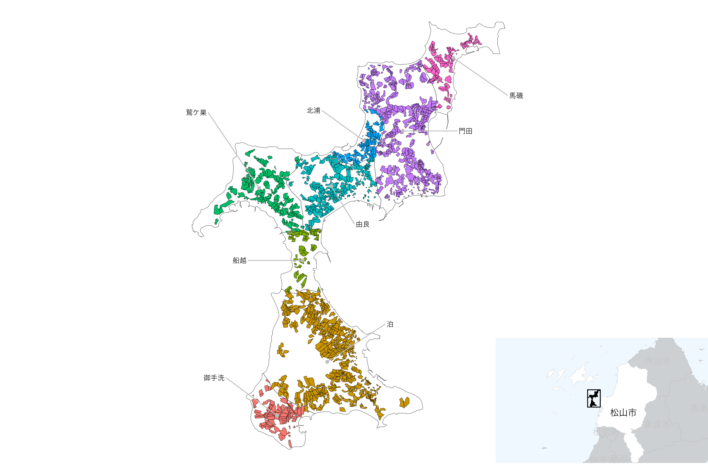

# Practical mapping examples

## Using `ggforce` package

``` r
library(dplyr)
library(sf)
library(ggplot2)
library(ggforce)

db <- combine_fude(d, b, city = "松山市", kcity = "興居島", rcom = "^(?!釣島)")
bbox <- sf::st_bbox(db$fude)

ggplot() +
  geom_sf(data = db$rcom, fill = NA) +
  geom_sf(data = db$fude, aes(fill = rcom_romaji)) +
  geom_mark_hull(
    data = db$fude |>
      group_by(rcom) |>
      mutate(
        n = gsub(
          "c\\(|\\)",
          "", 
          paste0(
            "Count of Fude: ", n(), "\n",
            list(table(land_type))
          ))
      ),
    aes(x = point_lng, y = point_lat,
        fill = rcom_romaji,
        label = rcom_romaji,
        description = n),
    colour = NA,
    expand = unit(1, "mm"),
    radius = unit(1, "mm"),
    label.fontsize = 9,
    label.family = "Helvetica",
    label.fill = "white",
    label.colour = "black",
#   label.buffer = unit(0, "pt"),
    con.colour = "black"
  ) +
  coord_sf(
    xlim = c(bbox["xmin"] - 0.02, bbox["xmax"] + 0.02),
    ylim = c(bbox["ymin"] - 0.01, bbox["ymax"] + 0.01)
  ) +
  theme_void() +
  theme(legend.position = "none")
```



**Source**: Created by processing the Ministry of Agriculture, Forestry
and Fisheries, ‘Fude Polygon Data (released in FY2025)’ and
‘Agricultural Community Boundary Data (FY2020)’.

## Displaying a wide area map with `cowplot`

If you want to be particular about the details of the map, for example,
execute the following code.

``` r
library(sf)
library(ggplot2)
library(gghighlight)
library(ggrepel)
library(cowplot)

minimap <- ggplot() +
  geom_sf(data = db$city, aes(fill = fill)) +
  geom_sf_text(data = db$city, aes(label = city_kanji), family = "Hiragino Sans") +
  gghighlight(fill == 1) +
  geom_sf(data = db$rcom_union, fill = "black", linewidth = 0) +
  theme_void() +
  theme(panel.background = element_rect(fill = "aliceblue")) +
  scale_fill_manual(values = c("white", "gray"))

mainmap <- ggplot() +
  geom_sf(data = db$rcom, fill = "white") +
  geom_sf(data = db$fude, aes(fill = rcom_name)) +
  geom_point(data = db$rcom, aes(x = x, y = y), colour = "gray") +
  geom_text_repel(
    data = db$rcom,
    aes(x = x, y = y, label = rcom_name),
    nudge_x = c(-.01, .01, -.01, -.01, .005, -.008, .01, .01),
    nudge_y = c(.005, .005, 0, .01, -.005, .004, 0, -.005),
    min.segment.length = .01,
    segment.color = "gray",
    size = 3,
    family = "Hiragino Sans"
  ) +
  theme_void() +
  theme(legend.position = "none")

bbox <- sf::st_bbox(db$city[db$city$fill == 1, ])

ggdraw(mainmap) +
  draw_plot(
    {
      minimap +
        geom_rect(
          aes(xmin = bbox$xmin, xmax = bbox$xmax,
              ymin = bbox$ymin, ymax = bbox$ymax),
          fill = NA,
          colour = "black",
          size = .5
        ) +
        coord_sf(
          xlim = bbox[c("xmin", "xmax")],
          ylim = bbox[c("ymin", "ymax")],
          expand = FALSE
        ) +
        theme(legend.position = "none")
    },
    x = .7, 
    y = 0,
    width = .3, 
    height = .3
  )
```



**出典**：農林水産省「筆ポリゴンデータ（2025年度公開）」および「農業集落境界データ（2020年度）」を加工して作成。
