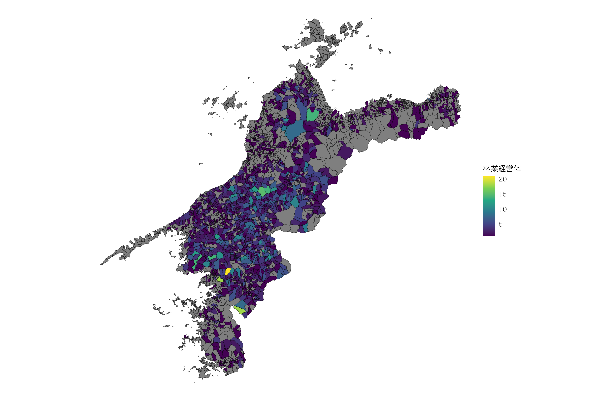
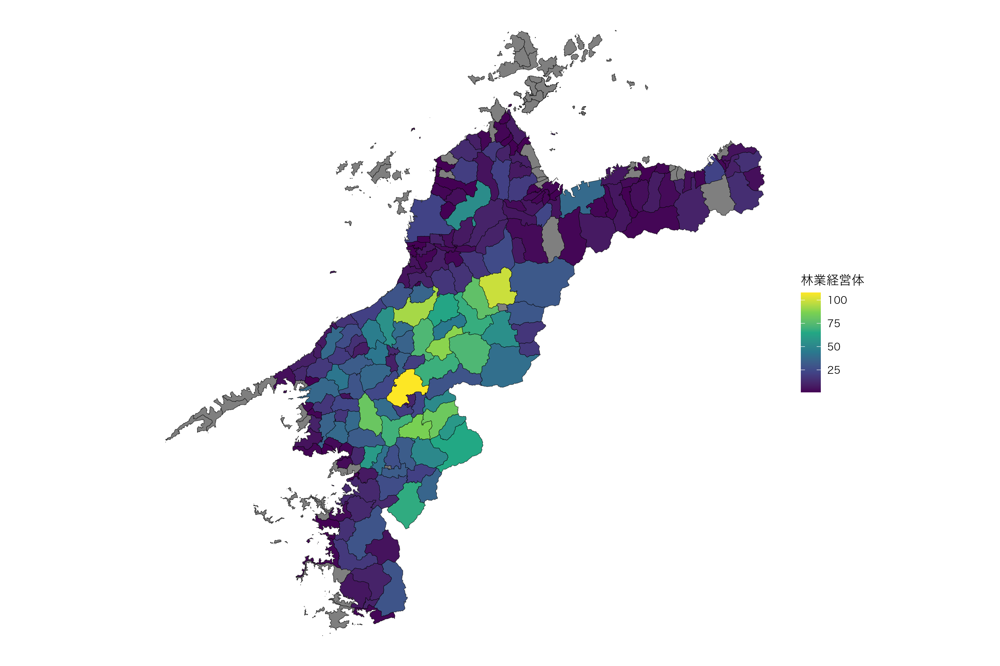
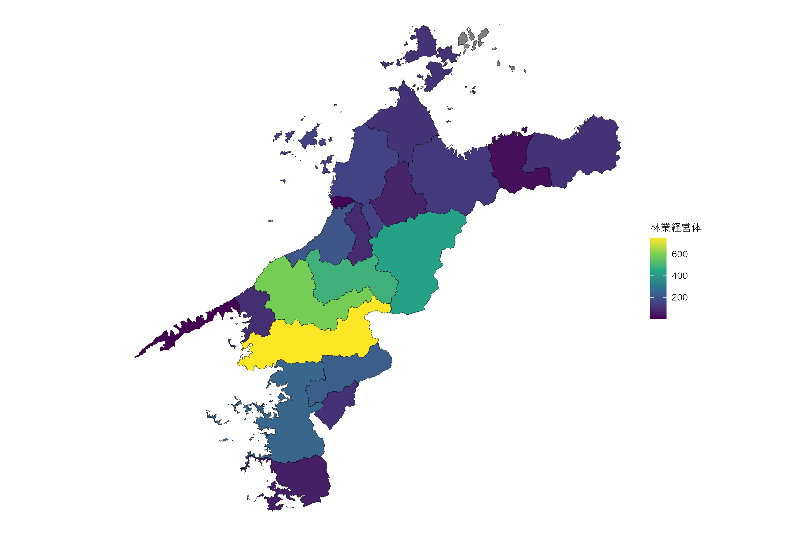

# Practical mapping examples with MAFF data

## Mapping MAFF data

``` r
library(dplyr)
library(sf)
library(ggplot2)

b1 <- get_boundary(d, path = "~", boundary_type = 1, quiet = TRUE)
b2 <- get_boundary(d, path = "~", boundary_type = 2, quiet = TRUE)
b3 <- get_boundary(d, path = "~", boundary_type = 3, quiet = TRUE)

e1 <- read_shuraku("~/IA0001_2023_2020_38.xlsx", b1)
e2 <- read_shuraku("~/IA0001_2023_2020_38.xlsx", b2)
e3 <- read_shuraku("~/IA0001_2023_2020_38.xlsx", b3)

e1$地域類型1次分類 <- factor(e1$地域類型1次分類, levels = sort(unique(na.omit(e1$地域類型1次分類))))
e2$地域類型1次分類 <- factor(e2$地域類型1次分類, levels = sort(unique(na.omit(e2$地域類型1次分類))))
e3$地域類型1次分類 <- factor(e3$地域類型1次分類, levels = sort(unique(na.omit(e3$地域類型1次分類))))

ggplot() +
  geom_sf(data = e1, aes(fill = 地域類型1次分類), alpha = .8) +
  theme_void() +
  theme(text = element_text(family = "Hiragino Sans"))
```


**出典**: 農林水産省「農業集落境界データ（2020年度）」を加工して作成。

``` r
ggplot() +
  geom_sf(data = e2, aes(fill = 地域類型1次分類), alpha = .8) +
  theme_void() +
  theme(text = element_text(family = "Hiragino Sans"))
```


**出典**: 農林水産省「農業集落境界データ（2020年度）」を加工して作成。

``` r
ggplot() +
  geom_sf(data = e3, aes(fill = 地域類型1次分類), alpha = .8) +
  theme_void() +
  theme(text = element_text(family = "Hiragino Sans"))
```


**出典**: 農林水産省「農業集落境界データ（2020年度）」を加工して作成。

``` r
e1 <- read_shuraku("~/SA1066_2020_2020_38.xlsx", b1)
e2 <- read_shuraku("~/SA1066_2020_2020_38.xlsx", b2)
e3 <- read_shuraku("~/SA1066_2020_2020_38.xlsx", b3)

ggplot() +
  geom_sf(data = e1, aes(fill = `類別作付（栽培）面積_果樹類`)) +
  scale_fill_gradient(
    low  = "white",
    high = "darkorange",
    na.value = "grey90"
  ) +
  theme_void() +
  theme(text = element_text(family = "Hiragino Sans"))
```


**出典**: 農林水産省「農業集落境界データ（2020年度）」を加工して作成。

``` r
ggplot() +
  geom_sf(data = e2, aes(fill = `類別作付（栽培）面積_果樹類`)) +
  scale_fill_gradient(
    low  = "white",
    high = "darkorange",
    na.value = "grey90"
  ) +
  theme_void() +
  theme(text = element_text(family = "Hiragino Sans"))
```


**出典**: 農林水産省「農業集落境界データ（2020年度）」を加工して作成。

``` r
ggplot() +
  geom_sf(data = e3, aes(fill = `類別作付（栽培）面積_果樹類`)) +
  scale_fill_gradient(
    low  = "white",
    high = "darkorange",
    na.value = "grey90"
  ) +
  theme_void() +
  theme(text = element_text(family = "Hiragino Sans"))
```


**出典**: 農林水産省「農業集落境界データ（2020年度）」を加工して作成。

``` r
e1 <- read_shuraku("~/SA0001_2010_2010_38.xlsx", b1)
e2 <- read_shuraku("~/SA0001_2010_2010_38.xlsx", b2)
e3 <- read_shuraku("~/SA0001_2010_2010_38.xlsx", b3)

library(viridis)

ggplot() +
  geom_sf(data = e1, aes(fill = `林業経営体`)) +
  scale_fill_viridis_c(option = "viridis") +
  theme_void() +
  theme(text = element_text(family = "Hiragino Sans"))
```



**出典**: 農林水産省「農業集落境界データ（2020年度）」を加工して作成。

``` r
ggplot() +
  geom_sf(data = e2, aes(fill = `林業経営体`)) +
  scale_fill_viridis_c(option = "viridis") +
  theme_void() +
  theme(text = element_text(family = "Hiragino Sans"))
```



**出典**: 農林水産省「農業集落境界データ（2020年度）」を加工して作成。

``` r
ggplot() +
  geom_sf(data = e3, aes(fill = `林業経営体`)) +
  scale_fill_viridis_c(option = "viridis") +
  theme_void() +
  theme(text = element_text(family = "Hiragino Sans"))
```



**出典**: 農林水産省「農業集落境界データ（2020年度）」を加工して作成。
