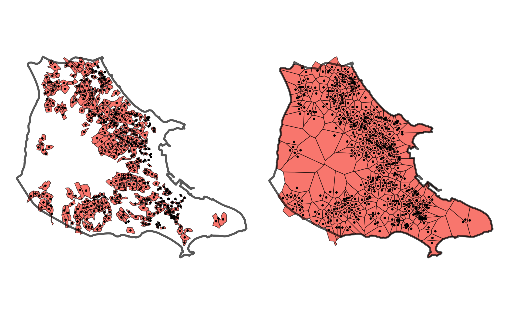
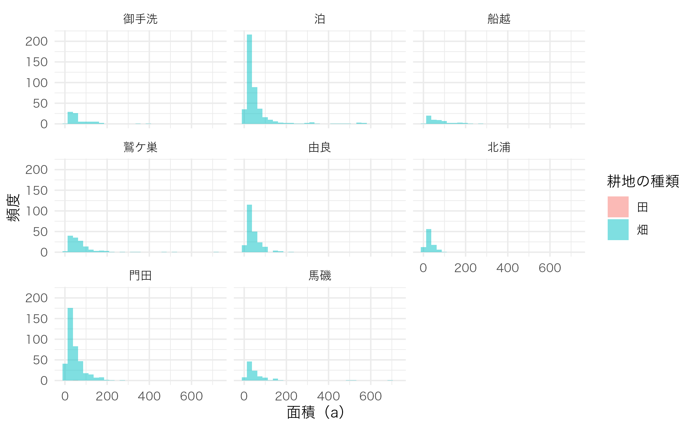
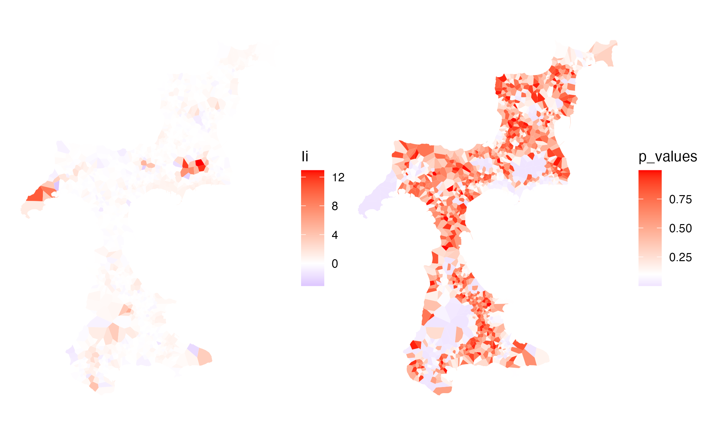
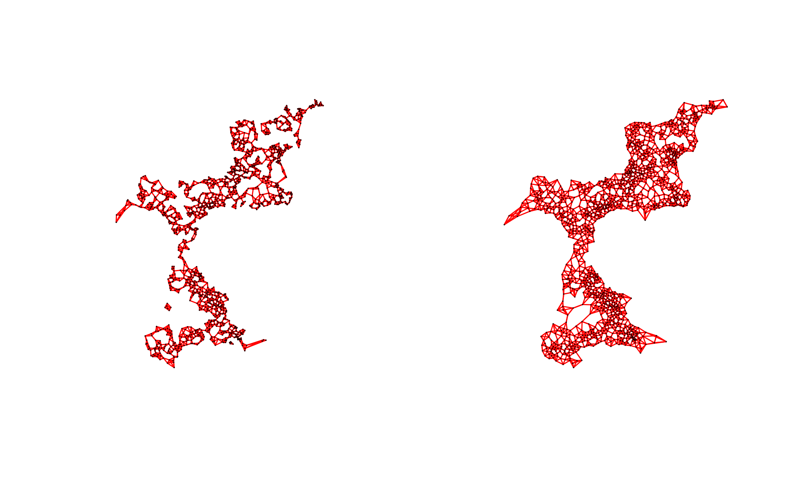
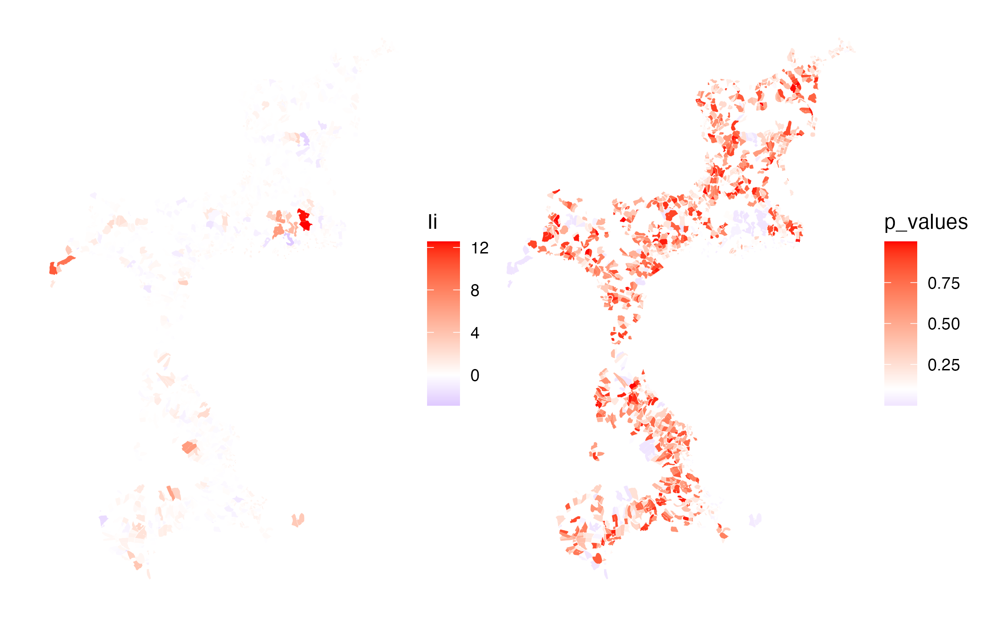
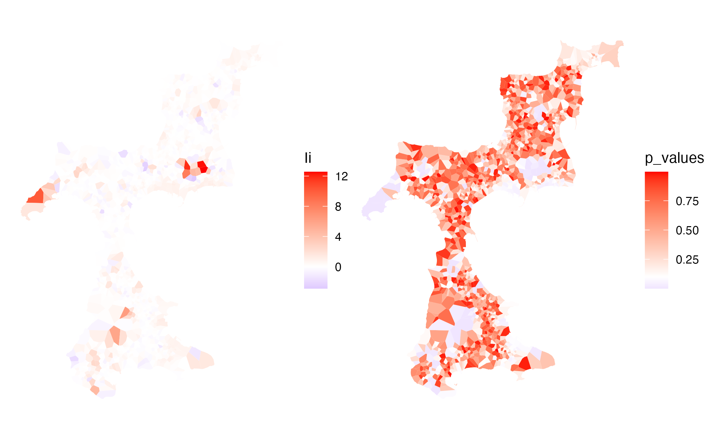

# Testing the functionality

## Testing the functionality

### `st_voronoi()`

``` r
library(fude)
library(dplyr)
library(ggplot2)
library(sf)
library(patchwork)

d <- read_fude("~/MB0001_2025_2020_38.zip", quiet = TRUE, supplementary = TRUE)
b <- get_boundary(d, path = "~", quiet = TRUE)
db <- combine_fude(d, b, city = "松山市", rcom = "由良|北浦|鷲ケ巣|門田|馬磯|泊|御手洗|船越")

db$fude_points <- db$fude |>
  sf::st_drop_geometry() |>
  dplyr::mutate(
    geometry = purrr::map(centroid, \(d) sf::st_point(c(d[1], d[2])))
  ) |>
  dplyr::mutate(
    geometry = sf::st_sfc(geometry, crs = 4326)
  ) |>
  sf::st_as_sf(crs = 4326)

fude_points_projected <- sf::st_transform(db$fude_points, crs = 6677)
rcom_union_projected <- sf::st_transform(db$rcom_union, crs = 6677)

voronoi <- fude_points_projected |>
  sf::st_geometry() |>
  sf::st_union() |>
  sf::st_voronoi() |>
  sf::st_collection_extract(type = "POLYGON") |>
  sf::st_sf(crs = 6677) |>
  sf::st_intersection(y = sf::st_geometry(rcom_union_projected)) |>
  sf::st_join(y = fude_points_projected) |>
  sf::st_cast("POLYGON") |>
  sf::st_transform(crs = 4326)

map1 <- ggplot() +
  geom_sf(
    data = db$fude |> filter(rcom_name == "泊"),
    aes(fill = rcom_name),
    linewidth = .3
  ) +
  geom_sf(data = db$fude_points |> filter(rcom_name == "泊"), size = .5) +
  geom_sf(
    data = db$rcom |> filter(rcom_name == "泊"),
    aes(fill = rcom_name),
    alpha = 0,
    linewidth = 1
  ) +
  theme_void() +
  theme(legend.position = "none")

map2 <- ggplot() +
  geom_sf(
    data = voronoi |> filter(rcom_name == "泊"),
    aes(fill = rcom_name),
    linewidth = .3
  ) +
  geom_sf(data = db$fude_points |> filter(rcom_name == "泊"), size = .5) +
  geom_sf(
    data = db$rcom |> filter(rcom_name == "泊"),
    aes(fill = rcom_name),
    alpha = 0,
    linewidth = 1
  ) +
  theme_void() +
  theme(legend.position = "none")

map1 + map2
```



**出典**：農林水産省「筆ポリゴンデータ（2025年度公開）」および「農業集落境界データ（2020年度）」を加工して作成。

``` r
voronoi$area_voronoi <- sf::st_area(voronoi)
voronoi$a_voronoi <- as.numeric(units::set_units(voronoi$area_voronoi, "a"))

ggplot(data = voronoi, aes(x = a_voronoi, fill = land_type_jp)) +
  geom_histogram(position = "identity", alpha = .5) +
  labs(x = "面積（a）", y = "頻度") +
  facet_wrap(~ rcom_name) +
  labs(fill = "耕地の種類") +
  theme_minimal() +
  theme(text = element_text(family = "Hiragino Sans"))
```



### `spdep::poly2nb()` and `localmoran()`

``` r
library(spdep)

coords <- sf::st_coordinates(sf::st_centroid(voronoi))
nb <- spdep::poly2nb(voronoi, queen = TRUE)
plot(nb, coords, cex = .01, col = "red")
```


``` r
lw <- spdep::nb2listw(nb, style = "W", zero.policy = TRUE)
(moran_test <- spdep::moran.test(voronoi$a, listw = lw))
```

    ## 
    ##  Moran I test under randomisation
    ## 
    ## data:  voronoi$a  
    ## weights: lw  
    ## n reduced by no-neighbour observations  
    ## 
    ## Moran I statistic standard deviate = 15.07, p-value < 2.2e-16
    ## alternative hypothesis: greater
    ## sample estimates:
    ## Moran I statistic       Expectation          Variance 
    ##      0.2303838689     -0.0006510417      0.0002350355

``` r
localmoran <- spdep::localmoran(voronoi$a, listw = lw)
localmoran_df <- as.data.frame(localmoran)
voronoi$Ii <- localmoran_df$Ii

gI <- ggplot() +
  geom_sf(data = voronoi, aes(fill = Ii), colour = "black", linewidth = 0) +
  scale_fill_gradient2(
    low = "blue",
    mid = "white",
    high = "red",
    midpoint = 0,
    space = "Lab",
    na.value = "grey50",
    guide = "colourbar",
    aesthetics = "fill"
  ) +
  theme_void()

voronoi$p_values <- localmoran_df[, "Pr(z != E(Ii))"]
sum(voronoi$p_values < 0.1, na.rm = TRUE) / nrow(voronoi)
```

    ## [1] 0.1885566

``` r
gp <- ggplot() +
  geom_sf(
    data = voronoi,
    aes(fill = p_values),
    colour = "black",
    linewidth = 0
  ) +
  scale_fill_gradient2(
    low = "blue",
    mid = "white",
    high = "red",
    midpoint = 0.1,
    space = "Lab",
    na.value = "grey50",
    guide = "colourbar",
    aesthetics = "fill"
  ) +
  theme_void()

gI + gp
```



**出典**：農林水産省「筆ポリゴンデータ（2025年度公開）」および「農業集落境界データ（2020年度）」を加工して作成。

### `spdep::knn2nb()` and `localmoran()`

``` r
coords1 <- sf::st_coordinates(db$fude_points)
nb1 <- spdep::knn2nb(spdep::knearneigh(coords1, k = 4))

coords2 <- sf::st_coordinates(sf::st_centroid(voronoi))
nb2 <- spdep::knn2nb(spdep::knearneigh(coords2, k = 4))

par(mfrow = c(1, 2))
plot(nb1, coords1, cex = .010, col = "red")
plot(nb2, coords2, cex = .010, col = "red")
```



``` r
lw1 <- spdep::nb2listw(nb1, style = "W")
(moran_test1 <- spdep::moran.test(db$fude_points$a, listw = lw1))
```

    ## 
    ##  Moran I test under randomisation
    ## 
    ## data:  db$fude_points$a  
    ## weights: lw1    
    ## 
    ## Moran I statistic standard deviate = 13.71, p-value < 2.2e-16
    ## alternative hypothesis: greater
    ## sample estimates:
    ## Moran I statistic       Expectation          Variance 
    ##      0.2315732305     -0.0006506181      0.0002868963

``` r
lw2 <- spdep::nb2listw(nb2, style = "W")
(moran_test2 <- spdep::moran.test(voronoi$a, listw = lw2))
```

    ## 
    ##  Moran I test under randomisation
    ## 
    ## data:  voronoi$a  
    ## weights: lw2    
    ## 
    ## Moran I statistic standard deviate = 13.383, p-value < 2.2e-16
    ## alternative hypothesis: greater
    ## sample estimates:
    ## Moran I statistic       Expectation          Variance 
    ##      0.2254942699     -0.0006506181      0.0002855370

``` r
localmoran <- spdep::localmoran(db$fude_points$a, listw = lw1)
localmoran_df <- as.data.frame(localmoran)
db$fude2 <- db$fude
db$fude2$Ii <- localmoran_df$Ii

gI <- ggplot() +
  geom_sf(data = db$fude2, aes(fill = Ii), colour = "black", linewidth = 0) +
  scale_fill_gradient2(
    low = "blue",
    mid = "white",
    high = "red",
    midpoint = 0,
    space = "Lab",
    na.value = "grey50",
    guide = "colourbar",
    aesthetics = "fill"
  ) +
  theme_void()

db$fude2$p_values <- localmoran_df[, "Pr(z != E(Ii))"]
sum(db$fude2$p_values < 0.1) / nrow(db$fude2)
```

    ## [1] 0.1254876

``` r
gp <- ggplot() +
  geom_sf(
    data = db$fude2,
    aes(fill = p_values),
    colour = "black",
    linewidth = 0
  ) +
  scale_fill_gradient2(
    low = "blue",
    mid = "white",
    high = "red",
    midpoint = 0.1,
    space = "Lab",
    na.value = "grey50",
    guide = "colourbar",
    aesthetics = "fill"
  ) +
  theme_void()

gI + gp
```



**出典**：農林水産省「筆ポリゴンデータ（2025年度公開）」および「農業集落境界データ（2020年度）」を加工して作成。

``` r
localmoran <- spdep::localmoran(voronoi$a, listw = lw2)
localmoran_df <- as.data.frame(localmoran)
voronoi$Ii <- localmoran_df$Ii

gI <- ggplot() +
  geom_sf(data = voronoi, aes(fill = Ii), colour = "black", linewidth = 0) +
  scale_fill_gradient2(
    low = "blue",
    mid = "white",
    high = "red",
    midpoint = 0,
    space = "Lab",
    na.value = "grey50",
    guide = "colourbar",
    aesthetics = "fill"
  ) +
  theme_void()

voronoi$p_values <- localmoran_df[, "Pr(z != E(Ii))"]
sum(voronoi$p_values < 0.1) / nrow(voronoi)
```

    ## [1] 0.1274382

``` r
gp <- ggplot() +
  geom_sf(
    data = voronoi,
    aes(fill = p_values),
    colour = "black",
    linewidth = 0
  ) +
  scale_fill_gradient2(
    low = "blue",
    mid = "white",
    high = "red",
    midpoint = 0.1,
    space = "Lab",
    na.value = "grey50",
    guide = "colourbar",
    aesthetics = "fill"
  ) +
  theme_void()

gI + gp
```



**出典**：農林水産省「筆ポリゴンデータ（2025年度公開）」および「農業集落境界データ（2020年度）」を加工して作成。
