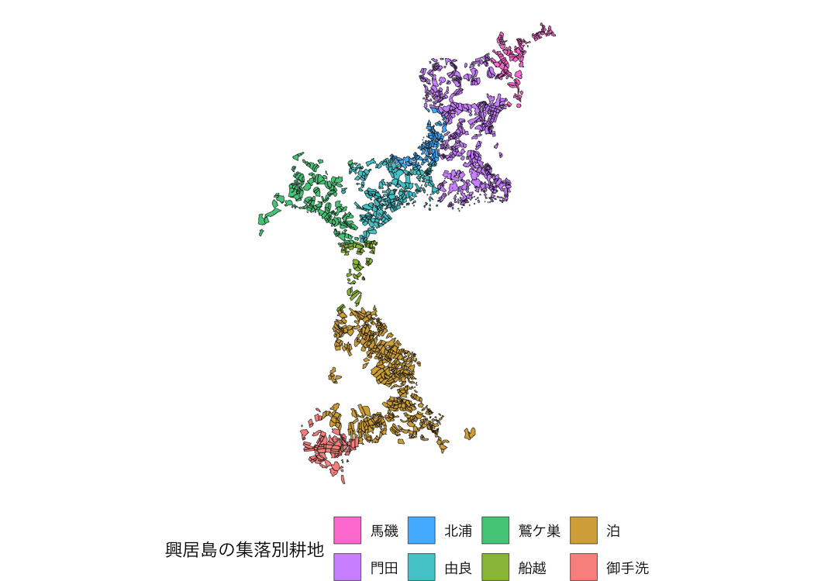
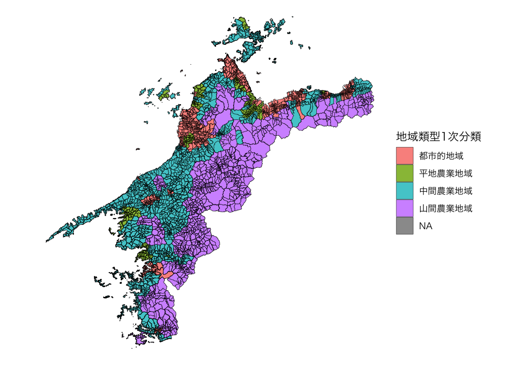

# fude

The fude package provides utilities to facilitate the handling of the
Fude Polygon data downloadable from the Ministry of Agriculture,
Forestry and Fisheries (MAFF) website. The word “fude” is a Japanese
counter suffix used to denote land parcels.

## Obtain data

Fude Polygon data can now be downloaded from two different MAFF websites
(both available only in Japanese):

1.  **GeoJSON format**:  
    <https://open.fude.maff.go.jp>

2.  **FlatGeobuf format**:  
    <https://www.maff.go.jp/j/tokei/census/shuraku_data/2020/mb/>

## Install the package

You can install the released version of fude from CRAN with:

``` r
install.packages("fude")
```

Or the development version from GitHub with:

``` r
# install.packages("devtools")
devtools::install_github("takeshinishimura/fude")
```

## Usage

### Read Fude Polygon data

There are two ways to load Fude Polygon data, depending on how the data
was obtained:

1.  **From a locally saved ZIP file**:  
    This method works for both GeoJSON (from Obtaining Data \#1) and
    FlatGeobuf (from Obtaining Data \#2) formats. You can load a ZIP
    file saved on your computer without unzipping it.

``` r
library(fude)
d <- read_fude("~/2022_38.zip")
```

2.  **By specifying a prefecture name or code**:  
    This method is available only for FlatGeobuf data (from Obtaining
    Data \#2). Provide the name of a prefecture (e.g., “愛媛”) or its
    corresponding prefecture code (e.g., “38”), and the required
    FlatGeobuf format ZIP file will be automatically downloaded and
    loaded.

``` r
d2 <- read_fude(pref = "愛媛")
```

### List the contents of Fude Polygon datal

``` r
ls_fude(d)
#> # A tibble: 20 × 7
#>    name     issue_year local_government_cd     n pref_name city_name city_romaji
#>    <chr>         <int> <chr>               <int> <chr>     <chr>     <chr>      
#>  1 2022_38…       2022 382019              72045 愛媛県    松山市    Matsuyama-…
#>  2 2022_38…       2022 382027              43396 愛媛県    今治市    Imabari-shi
#>  3 2022_38…       2022 382035              61683 愛媛県    宇和島市  Uwajima-shi
#>  4 2022_38…       2022 382043              37753 愛媛県    八幡浜市  Yawatahama…
#>  5 2022_38…       2022 382051              15734 愛媛県    新居浜市  Niihama-shi
#>  6 2022_38…       2022 382060              63244 愛媛県    西条市    Saijo-shi  
#>  7 2022_38…       2022 382078              37570 愛媛県    大洲市    Ozu-shi    
#>  8 2022_38…       2022 382108              33302 愛媛県    伊予市    Iyo-shi    
#>  9 2022_38…       2022 382132              34781 愛媛県    四国中央市…… Shikokuchu…
#> 10 2022_38…       2022 382141              73676 愛媛県    西予市    Seiyo-shi  
#> 11 2022_38…       2022 382159              24235 愛媛県    東温市    Toon-shi   
#> 12 2022_38…       2022 383562               2195 愛媛県    上島町    Kamijima-c…
#> 13 2022_38…       2022 383864              22823 愛媛県    久万高原町…… Kumakogen-…
#> 14 2022_38…       2022 384011               8634 愛媛県    松前町    Matsumae-c…
#> 15 2022_38…       2022 384020               7042 愛媛県    砥部町    Tobe-cho   
#> 16 2022_38…       2022 384224              27131 愛媛県    内子町    Uchiko-cho 
#> 17 2022_38…       2022 384429              23429 愛媛県    伊方町    Ikata-cho  
#> 18 2022_38…       2022 384844               9089 愛媛県    松野町    Matsuno-cho
#> 19 2022_38…       2022 384887              16550 愛媛県    鬼北町    Kihoku-cho 
#> 20 2022_38…       2022 385069              22931 愛媛県    愛南町    Ainan-cho
```

### Rename the local government code

**Note:** This feature is available only for data obtained from GeoJSON
(Obtaining Data \#1).

Convert local government codes into Japanese municipality names for
easier management.

``` r
dro <- rename_fude(d)
names(dro)
#>  [1] "2022_松山市"     "2022_今治市"     "2022_宇和島市"   "2022_八幡浜市"  
#>  [5] "2022_新居浜市"   "2022_西条市"     "2022_大洲市"     "2022_伊予市"    
#>  [9] "2022_四国中央市" "2022_西予市"     "2022_東温市"     "2022_上島町"    
#> [13] "2022_久万高原町" "2022_松前町"     "2022_砥部町"     "2022_内子町"    
#> [17] "2022_伊方町"     "2022_松野町"     "2022_鬼北町"     "2022_愛南町"
```

You can also rename the columns to Romaji instead of Japanese.

``` r
dro <- d |>
  rename_fude(suffix = TRUE, romaji = "title", quiet = FALSE)
#> 2022_382019 -> 2022_Matsuyama-shi
#> 2022_382027 -> 2022_Imabari-shi
#> 2022_382035 -> 2022_Uwajima-shi
#> 2022_382043 -> 2022_Yawatahama-shi
#> 2022_382051 -> 2022_Niihama-shi
#> 2022_382060 -> 2022_Saijo-shi
#> 2022_382078 -> 2022_Ozu-shi
#> 2022_382108 -> 2022_Iyo-shi
#> 2022_382132 -> 2022_Shikokuchuo-shi
#> 2022_382141 -> 2022_Seiyo-shi
#> 2022_382159 -> 2022_Toon-shi
#> 2022_383562 -> 2022_Kamijima-cho
#> 2022_383864 -> 2022_Kumakogen-cho
#> 2022_384011 -> 2022_Matsumae-cho
#> 2022_384020 -> 2022_Tobe-cho
#> 2022_384224 -> 2022_Uchiko-cho
#> 2022_384429 -> 2022_Ikata-cho
#> 2022_384844 -> 2022_Matsuno-cho
#> 2022_384887 -> 2022_Kihoku-cho
#> 2022_385069 -> 2022_Ainan-cho
```

### Get agricultural community boundary data

Download the agricultural community boundary data, which corresponds to
the Fude Polygon data, from the MAFF website:
<https://www.maff.go.jp/j/tokei/census/shuraku_data/2020/ma/> (available
only in Japanese).

``` r
b <- get_boundary(d)
```

### Combine Fude Polygons with agricultural community boundaries

You can easily combine Fude Polygons with agricultural community
boundaries to create enriched spatial analyses or maps.

``` r
library(ggplot2)

db <- combine_fude(d2, b, city = "松山市", rcom = "由良|北浦|鷲ケ巣|門田|馬磯|泊|御手洗|船越")

ggplot() +
  geom_sf(data = db$fude, aes(fill = rcom_name), alpha = .8) +
  guides(fill = guide_legend(reverse = TRUE, title = "興居島の集落別耕地")) +
  theme_void() +
  theme(legend.position = "bottom") +
  theme(text = element_text(family = "Hiragino Sans"))
```



**出典**：農林水産省「筆ポリゴンデータ（2025年度公開）」および「農業集落境界データ（2020年度）」を加工して作成。

Data enables extraction based on municipality names, former municipality
names, and agricultural community names.

**Note:** This feature is available only for data obtained from
FlatGeobuf (Obtaining Data \#2).

``` r
extract_fude(d2, city = "松山市", kcity = "興居島")
#> Simple feature collection with 1691 features and 6 fields
#> Geometry type: MULTIPOLYGON
#> Dimension:     XY
#> Bounding box:  xmin: 132.6373 ymin: 33.87055 xmax: 132.6991 ymax: 33.92544
#> Geodetic CRS:  JGD2000
#> # A tibble: 1,691 × 7
#>    polygon_uuid                   land_type issue_year point_lng point_lat key  
#>  * <chr>                              <dbl>      <dbl>     <dbl>     <dbl> <chr>
#>  1 5a72b4ef-b5f4-465e-9948-e9314…       200       2025      133.      33.9 3820…
#>  2 c69d86d5-1fb2-4528-a87b-155d8…       200       2025      133.      33.9 3820…
#>  3 627134ea-919c-4769-bd94-be16c…       200       2025      133.      33.9 3820…
#>  4 f2631019-d16e-42f9-8501-75f26…       200       2025      133.      33.9 3820…
#>  5 8fedb70d-4bb9-4447-879b-a0eea…       200       2025      133.      33.9 3820…
#>  6 cd235cdf-da51-4ead-ad50-efc6e…       200       2025      133.      33.9 3820…
#>  7 5853b7a1-62c3-4973-9e79-cabd3…       200       2025      133.      33.9 3820…
#>  8 5e090780-6d16-4b9e-aca9-c5622…       200       2025      133.      33.9 3820…
#>  9 90de4abf-e972-4031-987f-f3391…       200       2025      133.      33.9 3820…
#> 10 e5ade914-c803-42d1-9fa8-0921b…       200       2025      133.      33.9 3820…
#> # ℹ 1,681 more rows
#> # ℹ 1 more variable: geometry <MULTIPOLYGON [°]>
```

### Explore Fude Polygon data

You can explore Fude Polygon data interactively.

``` r
library(shiny)

s <- shiny_fude(db, rcom = TRUE)
# shinyApp(ui = s$ui, server = s$server)
```

### Read data from the MAFF database

You can read data from the MAFF database
([地域の農業を見て・知って・活かすDB](https://www.maff.go.jp/j/tokei/census/shuraku_data/)).

``` r
library(dplyr)

b1 <- get_boundary(d2, path = "~", boundary_type = 1, quiet = TRUE)
b2 <- get_boundary(d2, path = "~", boundary_type = 2, quiet = TRUE)
b3 <- get_boundary(d2, path = "~", boundary_type = 3, quiet = TRUE)

m1 <- b1 |>
  read_ikasudb("~/IA0001_2023_2020_38.xlsx") |>
  read_ikasudb("~/SA1009_2020_2020_38.xlsx") |>
  read_ikasudb("~/GC0001_2019_2020_38.xlsx") |>
  mutate(
    地域類型1次分類 = factor(地域類型1次分類, labels = c("都市的地域", "平地農業地域", "中間農業地域", "山間農業地域"))
  )

ggplot() +
  geom_sf(data = m1, aes(fill = 地域類型1次分類), alpha = .8) +
  theme_void() +
  theme(text = element_text(family = "Hiragino Sans"))
```



**資料**：農林水産省「農業集落境界データ（2020年度）」を加工して作成。

### Use the `mapview` package

If you want to use
[`mapview()`](https://r-spatial.github.io/mapview/reference/mapView.html),
do the following.

``` r
db1 <- combine_fude(d, b, city = "伊方町")
db2 <- combine_fude(d, b, city = "八幡浜市")
db3 <- combine_fude(d, b, city = "西予市", kcity = "三瓶|二木生|三島|双岩")

db <- bind_fude(db1, db2, db3)
db$fude <- sf::st_transform(db$fude, crs = 3857)

library(mapview)

mapview(db$fude, zcol = "rcom_name", layer.name = "農業集落名")
```
